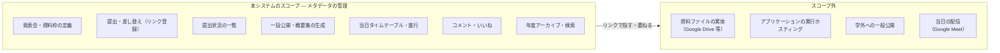
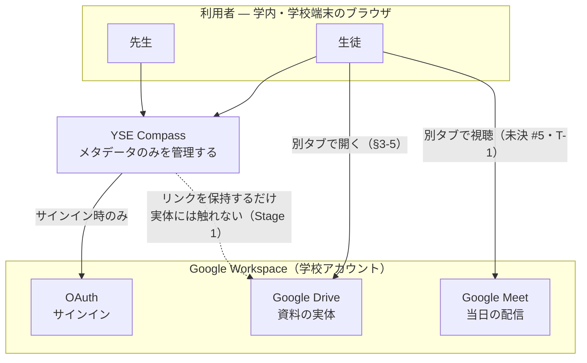
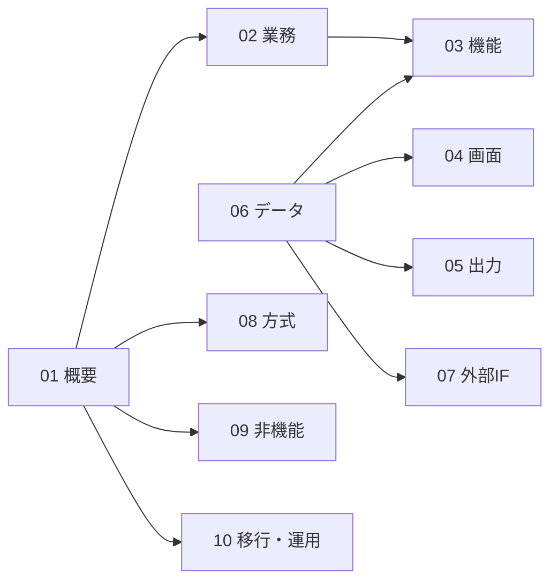

# 01. システム概要

> **位置づけ**：このシステムが何で、誰が使い、どこまでやるのかを、設計の入口として1枚で答える
> **確度**：**暫定（レビュー未了）**
> **正典**：派生（元：`../requirements.md` §1・企画書 §1〜§4）
> **更新のしかた**：上書き
> **主担当**：水戸
> **最終更新**：2026-09-06（水戸・1-1〜1-5 を執筆／H-16 決着を 1-3 へ反映）

## この章が答える問い

設計書を初めて読む人（＝先生・審査者・来年の後輩）が、**他の章を読む前に持つべき前提**は何か。

## 書かないもの

| 書かないこと | 参照先 |
| --- | --- |
| 機能の一覧と受け入れ基準 | `../requirements.md` §3 |
| やらないことの根拠（全文） | `../decisions.md` 2026-07-17 の3行 |
| 技術スタック・レイヤ構成・デプロイ構成 | `08-architecture.md` 8-1・8-3・8-7 |
| Google との IF の仕様（スコープ・シーケンス・失敗時の挙動） | `07-interface.md` |
| 業務フローと、業務のうちシステム化しない範囲 | `02-business-flow.md` |

> **1-4 の全体構成図は「役割分担」であって「技術構成図」ではない。** コンテナ・DB・通信経路を含む技術的な構成は `08-architecture.md` 8-2 が正典。**同じ図を2箇所に置かない。**

---

## 1-1. システム化の目的と背景

### 解こうとしている課題

**運営側（先生）— 手作業への依存が、負荷と属人化を生んでいる。**

卒業制作は年4回の発表会（企画・設計・試作・最終）で進むが、その運営が手作業に依存している。提出状況の把握は目視確認、配信用資料の整理は発表順どおりの手作業、資料を集約する Google Drive への導線は担任ごとに不統一。先生アンケートでも「チーム・メンバー管理の自動化」「提出状況管理の手作業」といった声として裏付けられている。

**利用側（生徒）— 発表が一度きりで流れ、後から辿れない。**

過去・他チームの企画を見返す手段がない。発表のために準備すべき資料が何かが分かりにくく、資料が置かれている Drive への導線も分かりにくい。

（出所：企画書 §1-1-1）

### 本システムの解

**卒業制作の発表会運営を効率化し、その成果を学校の資産として蓄積していくプラットフォーム**（企画書 §1-1-2）。

設計としての言い方に直すと、狙いは次の1文に畳める。

> **資料の提出という1つの行為が、提出管理・発表順の整理・アーカイブを副産物として成立させる。**

先生が別途「集計する」「並べる」「保存する」ための操作を積み増さなくても、**生徒の提出と、先生の明示操作（公開・当日進行・年度アーカイブ）だけで運営が1周する**形を目指す。

### この背景が、設計全体にかけている制約

背景を設計要素へ翻訳すると、以下3つが全章に効く。**個別の章で再検討せず、ここを前提として扱う。**

| 背景 | 設計への帰結 | 出典 |
| --- | --- | --- |
| 属人化＝管理場所が散っている | 管理場所を1か所に集約し、二重管理を作らない。同じ事実を2箇所に持たない（例：技術情報の SSoT は概要フォームの使用技術欄で、独立したタグ機能は作らない） | `../requirements.md` §3-7 |
| 手作業＝**先生が操作の起点である** | 状態遷移（公開・当日進行・年度アーカイブ）は先生の明示操作を正とし、時刻・条件による自動遷移を持たない。**帰結としてバッチ・スケジューラを設計に入れない** | `../requirements.md` §3 冒頭（2026-07-26） |
| 目的が「蓄積」である | 保持期間は**無期限・削除機能を持たない**（論理削除も不要）。実体を持たない（1-2）ため容量増分が小さく、この判断が成立する | `../requirements.md` §4（2026-07-26） |

### 引き受けなかった課題 — 明示しておく1点

企画書 §1-1-1 は生徒側の課題として「Classroom 経由の質問・コメントは氏名・学年が公開されるため投稿の心理的障壁が高い」も挙げているが、**本システムは匿名化という手段では応えない。** 投稿は実名（学校アカウントのフルネーム）で表示し、匿名・ニックネームでの投稿はできない — 先生依頼「責任ある発言」を顧客要件として採用したためである（`../requirements.md` §3-9・§4／2026-07-24）。

**したがって本システムが引き受ける生徒側の課題は「見返せない」「導線が分かりにくい」の2点に絞られている。** 企画書と記述が食い違う場合は `../requirements.md` が優先する（同書 冒頭の注記）。

---

## 1-2. システム化の範囲

### スコープ境界図

### やらないことと、その設計への帰結

**根拠の全文は書かない。** ここに置くのは「やらないと決めた結果、設計がどう形を変えたか」だけである。

| やらないこと | 設計への帰結（この設計書のどこに効くか） | 根拠の所在 |
| --- | --- | --- |
| **資料ファイルの実体保管** | **アップロード UI が1つも存在しない。** 提出とはリンクの登録であり、形式（Canva／PPTX／Google スライド／動画）に依存せず全対応できる。閲覧は別タブでリンク先へ遷移する（`../requirements.md` §3-5）。システム内のネイティブプレビューは持たない。外部との接点は `07-interface.md` | `../decisions.md` 2026-07-17 |
| **アプリケーションの実行ホスティング** | 管理対象は「発表資料」に留まる。実行環境・サンドボックスに関する設計を一切持たない | `../decisions.md` 2026-07-17 |
| **学外への一般公開** | 学校内専用の Web システム。**この前提は 1-3 の先生ホワイトリスト方式の成立条件でもある**（学校 Workspace ドメイン限定サインイン） | 企画書 §4-2 継承 |

> **「スコープ外」と「未決」は別物。** 上表は決着済みの範囲外である。**まだ決めていないもの**（例：Google Drive 統合をどこまで自動化するか＝#10）は `../open-questions.md` にあり、未決の上に書く設計は **Stage 1＝リンク登録**で先行する（`00-conventions.md` §3-3）。
>
> **業務のうちシステム化しない範囲は `02-business-flow.md` 2-4 が持つ。** 本節はシステムの境界、2-4 は業務の境界で、切り口が違う。

---

## 1-3. 利用者と役割

### ロールは2値

**ロールが DB で持つ値は「先生／生徒」の2値で足りる**（`../glossary.md` ユーザーとロール）。

| ロール | 誰か | 主にすること |
| --- | --- | --- |
| **先生** | 卒業制作の運営を担当する YSE の先生（メインターゲット・企画書 §1-2-1） | 発表会と資料枠の定義／チーム・メンバーの作成／提出状況の確認／資料の一括公開／当日タイムテーブルの編集と進行／年度アーカイブ／議論への参加 |
| **生徒** | 卒業制作に取り組む YSE の生徒（利用ターゲット・同上） | 自チームの提出と差し替え／公開資料の閲覧／コメント・いいね／過去作品の検索・閲覧 |

### 「発表する生徒」「聴く生徒」はロールではない

**同一の生徒が、その発表が自チームか否かで切り替わる文脈である。** ここをロールとして DB に持つと、認可設計が肥大する（`../glossary.md`）。

| 場面 | その生徒の文脈 | できること |
| --- | --- | --- |
| 自チームの発表 | 発表する側 | 資料の提出・差し替え、自チームに寄せられたコメントへの返信 |
| 他チームの発表 | 聴く側 | 公開資料の閲覧、コメント・いいねの投稿 |

**リーダー（チーム代表者）もロールではない。** チームの属性（代表者1名への参照）として持ち、責務は**公開許可の設定のみ**で他の権限を持たない（2026-09-04 確定・`../glossary.md`）。

### ロールの解決方法 — 先生ホワイトリスト方式

**確定（2026-09-05・未決 H-10 の決着／`../decisions.md`）**

- **先生だけを登録し、学校 Workspace ドメインでサインインしたそれ以外のユーザーは全員「生徒」**として扱う。メールアドレスのパターンによる判定は行わない
- **前提**：サインインできるのは学校 Workspace ドメインのアカウントのみ（`../requirements.md` §5）。**この前提が崩れると方式ごと成立しない**
- 誤判定は必ず安全側（先生が生徒として扱われる）に倒れ、権限昇格は起きない
- **残る未決**：最初のスーパーユーザーがどこから生まれるか（**H-11**）／先生ロールの親子二層構造の要否（**#8**）。**どの層で認可を担保するかは 2026-09-06 に決着した** — 一次防衛線は**データアクセス層**（`../requirements.md` §4 セキュリティ／`09-nfr.md` 9-4）

---

## 1-4. システム全体構成

**本システムは単体で完結せず、Google Workspace の上に乗る。** 何を自分で持ち、何を外に委ねているのかを先に固定する。

| 何を | どこが持つか | 本システムとの関係 |
| --- | --- | --- |
| 資料の実体（ファイル） | **Google Drive 等の外部** | **持たない。** リンク（URL）をメタデータとして保持するのみ。実体へはブラウザが別タブで遷移する |
| アカウントと認証 | **Google Workspace（学校）** | 認証を委譲する。接続はサインイン時のみ発生し、以降はアプリのセッションで完結する（`08-architecture.md` 8-2） |
| 当日の配信 | **Google Meet** | **連携しない。** 生徒は Meet と本システムを2つのタブで併用する |
| 提出状態・発表順・コメント・いいね・公開許可・概要 | **本システム** | ここが唯一の管理場所（Single Source of Truth） |

> **Meet 配信の併用は 2026-07-17 の運用実見で確認済みの現行運用**（`../open-questions.md` #5）。本システムは配信そのものに関与しないが、**当日 120 名が Meet を見ながら資料を開く体験（2タブ UX）は未決**であり、画面設計に効く（#5・T-1）。
>
> **Drive 連携の深さは未決（#10）。** 現在の設計は **Stage 1＝所定フォルダへの運用配置＋リンク登録**で成立するよう書かれている。決着すると上図の点線（アプリ → Drive）が API 呼び出しに変わり、`07-interface.md` 7-3 に差分が生じる。**論点は「どこまで自動化するか」ではなく「どの OAuth スコープを要求するか」**である（H-12）。

---

## 1-5. 本設計書の読み方

### 章の依存関係

**06 データ設計が全体のクリティカルパス。** 03・04・05・07 は 06 に依存する。09・10 は 06 と独立しており並行して読める。

### 読者別の最短経路

| 読む人 | 読む順 | 何が分かるか |
| --- | --- | --- |
| **先生・審査者**（何ができるものか知りたい） | 01 → 02 → 04 → 05 | 業務のどこに挿さり、どんな画面で、何が出力されるか |
| **実装する人** | 01 → 06 → 03 → 07 → 08 | データの形 → 機能の処理 → 外部との接点 → 動かす技術 |
| **来年の後輩**（引き継ぐ人） | 01 → 02 → 10 → `../decisions.md` | 何のためのシステムで、どう運用し、**なぜこうなっているか** |

> **本節は「読む側」の順序であって、「書く側」の順序ではない。** 章を埋めるための最短経路（06 がクリティカルパスである理由・どの章がどの未決で止まっているか）は `00-conventions.md` §5-3・§5-4 が持つ。
>
> **`design/` は全章が確度「暫定」（レビュー未了）。** 参照はしてよいが、**決定の根拠として引用しない**（`../../CLAUDE.md` 禁則6）。決定の正典は `../decisions.md`、未決の正典は `../open-questions.md`、要件の正典は `../requirements.md`。

---

## 現在の状態

**書き切った。1-1〜1-5 のすべてに本文がある。保留した節は無い。**

- **新規の未決は起票していない。** 執筆にあたり参照した出典は `../requirements.md` §1・§3-5〜§3-10・§4・§5、`../glossary.md`、`../decisions.md`（2026-07-17／2026-07-26／2026-09-04／2026-09-05）、`../open-questions.md`（#5・#8・#10・H-11・H-12・H-16 ※ H-16 は 2026-09-06 に決着）、企画書 §1〜§4
- **1-2 の範囲外3件は決着済みのもののみを載せた。** 未決である Drive 統合の深さ（#10）は範囲外の表に入れず、1-4 に Stage 1 前提として明示した
- **レビューで見てほしい点**：1-1「引き受けなかった課題」の扱い。**企画書が挙げた課題のうち匿名化を採らなかったことを、概要章で明示してよいか**（企画書は Ph.0 の凍結済み正典であり、先生へ説明済みの文書である）。チームの合意が要ると判断されたら `../open-questions.md` に起票する
