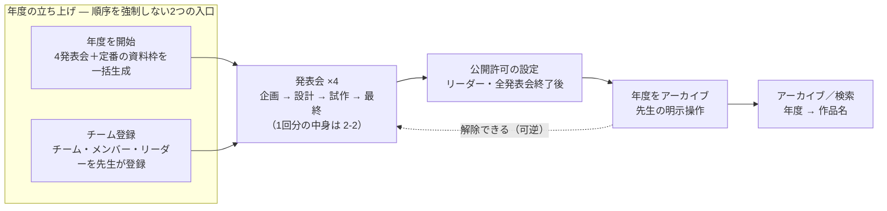
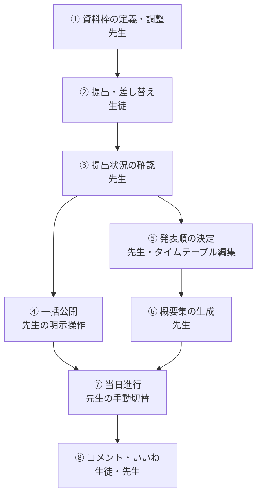

# 02. 業務設計

> **位置づけ**：卒業制作の1年がどう回り、そのどこを本システムが担うのかを答える
> **確度**：**暫定（レビュー未了）**
> **正典**：派生（元：`../hearing.md`・`../requirements.md` §3）
> **更新のしかた**：上書き
> **主担当**：水戸
> **最終更新**：2026-09-06（水戸・2-1〜2-4 を執筆。執筆中に H-19 を起票）

## この章が答える問い

**先生と生徒の現行業務のどこに、システムが挿さるのか。** 機能設計（03）の前に、業務の側から見た全体像を固定する。

## 書かないもの

| 書かないこと | 参照先 |
| --- | --- |
| 先生の現行運用の一次情報（発言・アンケート回答の原文） | `../hearing.md` |
| 各機能の受け入れ基準 | `../requirements.md` §3 |
| 画面の遷移 | `04-screen.md` |
| システムそのものの機能境界（やらないこと） | `01-overview.md` 1-2 |

> **2-2 は画面遷移図ではない。** 業務の流れであって、画面の流れではない。混ぜると 04 と二重になる。
>
> **1-2 と 2-4 は切り口が違う。** 1-2 は「システムが持たない機能」、2-4 は「**人がやり続ける業務**」。同じものを2回書かないため、2-4 は必ず**担い手**を列に持つ。

---

## 2-1. 年度運営サイクル

**運営の最大単位は年度**（`../glossary.md`）。年度は先生の「年度を開始」操作で立ち上がり、「年度をアーカイブ」操作で運営動線から外れる。**アーカイブは可逆**（2026-07-26）。

### この図が持っている設計判断

- **「年度を開始」と「チーム登録」の間に順序はない**（2026-09-04・**H-9 決着**／`../decisions.md`）。どちらから始めてもよく、**チームが0件のときの提出状況一覧は空状態を表示する**。上図で2つを並置しているのはこの決着の反映であり、単なる作図上の都合ではない
- **年度セットアップが発表会作成の正規入口。** 任意個数・任意種別の発表会作成は持たない（2026-07-24・`../requirements.md` §3-1）。したがって上図に「発表会を追加する」枝は存在しない
- **年度の終端は時刻ではなく先生の操作。** 自動遷移を持たない設計原則（`../requirements.md` §3 冒頭）の、年度粒度での現れ
- **公開許可の設定は「全発表会終了後・在校中」に置かれている**（2026-07-26）。卒業後に卒業生を追いかけない、という運用上の要請から来た配置で、アーカイブ操作より前にある理由がこれ

---

## 2-2. 発表会1回の業務フロー

**年4回、同じ形が繰り返される。** 回種別（企画／設計／試作／最終）で変わるのは資料枠の構成だけで、業務の流れそのものは共通である。

### 図の読み方

- **③のあと、④公開系と⑤⑥発表順系の2本に分かれる。** ⑥概要集の並び順の源は⑤の発表順である（`../requirements.md` §3-3・§3-10）。この依存があるため、**⑤を⑥より後ろに置くことはできない**
- **一方向に閉じない。** ②の差し替えは締切を超過してもでき、終端は年度アーカイブである（ソフトデッドライン・2026-07-26／`../requirements.md` §3-4）。図の②は「一度きりの提出」ではなく、⑧まで進んだ後も開いている
- **④のタイミングは先生の裁量。** 正典は公開を「先生の明示操作」とだけ定めており、⑦当日との前後関係を規定していない（`../requirements.md` §3-3）。図で④を⑦の手前に置いているのは業務上の一般的な順序であって、**システムが強制する制約ではない**

### この流れに乗っている未決

| 未決 | 図のどこに効くか |
| --- | --- |
| **H-7** ソフトデッドライン化と概要集生成の関係 | ②が開いたままなので、⑥をいつ実行してよいかの判断基準が無い |
| **H-8** 公開済み概要集の陳腐化 | ⑤の発表順を変えると、既に配布した⑥の成果物が古くなる |
| **H-6** 差し替えが上書きなので期限内提出が後から遅延に化ける | ②→③の間。提出状態の正しさそのもの |

---

## 2-3. 業務とシステムの対応

**この表が本章の中心。** 「現行のやり方」列は一次情報の要約であり、**原文は `../hearing.md` にある**（詳細をここへ転記しない）。

| # | 業務ステップ | 現行のやり方 | 本システムでのやり方 | 対応要件 |
| --- | --- | --- | --- | --- |
| 1 | 年度の立ち上げ（4発表会と資料枠の用意） | 過去の踏襲。定型の構成が暗黙知として先生の側にある | 「年度を開始」で4発表会＋定番の資料枠構成を一括生成。生成後に個別編集できる | §3-1 |
| 2 | チーム編成の登録 | 2年次1学期に決定した編成を**スプレッドシートで手作業管理**（`../hearing.md` §1・§7-1） | 先生がチーム作成・メンバー割り当て・リーダー指定を行う。生徒はチームを作成できない | §3-8 |
| 3 | 資料の提出 | Drive へ各自配置。**導線が担任ごとに不統一**（企画書 §1-1-1） | 資料枠に対してリンクを登録する。**概要枠のみ構造化フォーム入力**（2026-09-04・H-2 決着） | §3-4・§3-3 |
| 4 | 提出状況の把握 | **目視確認**（企画書 §1-1-1） | 「チーム × 資料枠」のマトリクスで一覧。遅延は提出日時と締切の比較による**導出表示** | §3-2 |
| 5 | 未提出への督促 | 口頭など | **システム化しない**（通知基盤を持たない・2026-07-24）→ 2-4 | §3-2 |
| 6 | 資料の生徒への配布 | Drive 導線の案内 | 発表会単位の**一括公開**（公開ボタン）。公開前は聴く生徒に表示されない | §3-3 |
| 7 | 発表順の決定 | スプレッドシートのタイムテーブル。**順番変更・押しはほぼ毎回**（`../hearing.md` §7-1） | タイムテーブル編集の**並び替えが発表順の決定そのもの**。専用の別画面は設けない（2026-09-04・H-5 決着） | §3-10 |
| 8 | 概要集の作成 | Word ↔ Google ドキュメントの互換対応・フォント調整・**発表順に合体して PDF 化**（`../hearing.md` §1・§2） | 構造化フォームで入力させ、**システム定義の統一レイアウト**で発表順に束ねて PDF を生成 | §3-3 |
| 9 | 当日の進行 | 手作業 | 「発表中」を先生が手動で切り替え、生徒画面はポーリングで追従（2026-09-04・#4 決着） | §3-10 |
| 10 | 発表への反応の回収 | Classroom 経由（氏名・学年が公開される） | 発表（チーム × 発表会）単位のコメント・ラベル・いいね。**実名表示**（2026-07-24） | §3-9 |
| 11 | 年度の締め | — | 「年度をアーカイブ」（可逆）。あわせてリーダーが公開許可を設定する | §3-7 |
| 12 | 過去作品の参照 | **手段がない**（企画書 §1-1-1） | 「年度 → 作品名」の導線＋キーワード検索（対象はメタデータ＋概要の構造化データ） | §3-7 |

### この表から読み取れる、設計の要点

**現行業務の置き換え方には2種類ある。** 単に手作業を画面に移しただけのものと、**業務の形そのものを変えたもの**を混同しない。

| 置き換えの型 | 該当 | 何が起きたか |
| --- | --- | --- |
| **手作業を画面へ移した** | 1・2・4・7・9 | 作業の場所が変わっただけで、判断は先生に残る（設計原則どおり自動化していない） |
| **業務の形を変えた** | **8 概要集の作成** | 「崩れたレイアウトを先生が直す」業務を、**入力の構造化と統一レイアウトによって発生させない**形に置き換えた。修正作業を効率化したのではなく、**消した** |
| **業務ごと消えた** | 3・12 | 導線の不統一（3）と参照手段の不在（12）は、管理場所の一元化そのものが解になっている |
| **システム化しない** | 5 | → 2-4 |

> **8 が本システムの中心的な価値。** 先生のゴール像は「生徒全員の提出が確認できたら、**内容を知らなくてもすぐにコピーできる状態**」（`../hearing.md` §1）であり、統一レイアウトはその手段である。**レイアウト編集 UI を作らないという制約は、機能の削減ではなく価値の本体**（`../requirements.md` §3-3）。

---

## 2-4. 業務のうちシステム化しない範囲

**ここに並ぶのは「人がやり続ける業務」である。** システムが持たない機能の一覧は `01-overview.md` 1-2 にあり、本節とは切り口が違う。**担い手の列が空になる行は、この表に置いてはならない**（＝誰も担わない業務は、設計の穴である）。

| 業務 | 担い手 | 本システムが担わない理由 | 出典 |
| --- | --- | --- | --- |
| Drive のフォルダ運用・権限設定・リンク切れへの対応 | 先生（**Drive 運用マニュアル**・未作成） | 実体を持たない設計の帰結。権限つきリンクの死活判定は技術的に不確実で、実装コストが大きい | `../requirements.md` §3-7・§4 |
| 当日の配信（Google Meet） | 先生 | 現行運用をそのまま継続する。本システムは配信に関与しない | `../open-questions.md` #5 |
| **提出リンクが実際に開けるかの確認（リハーサル）** | **未定義 — H-19** | リンクのアクセス可否をシステムが検証しないため、確認は運用側に委ねられている。**ただしその運用が正典に定義されていない** | `../requirements.md` §3-4・`../open-questions.md` **H-19** |
| チーム編成の意思決定 | 先生（2年次1学期） | システムは決まった編成の登録先であり、編成そのものは業務に属する | `../hearing.md` §7-1 |
| 未提出者への督促 | 先生 | 通知基盤を持たない（2026-07-24）。可視化までがシステムの責務 | `../requirements.md` §3-2 |
| テンプレートの遵守指導・フォーマット崩れへの対応 | 先生 | 強制も検知もしない。**ただし概要枠については統一レイアウトにより崩れ自体が発生しない**（2-3 の 8）ため、残るのは概要以外の資料枠の話 | `../requirements.md` §3-1・`../open-questions.md` #7 |
| 会場設営 | 先生 | 責任範囲の判断を含め**未回収**。継続ヒヤリング事項 | 企画書 §8-2・`../hearing.md` §7-3 |
| 卒業生のデータ削除請求への対応 | 学校（Drive 管理） | 公開許可は「アーカイブでの表示」への同意であって削除請求の手段ではない。本システムが担うのは表示制御のみ | `../requirements.md` §4 |

> **「リハーサル」の行だけ担い手が埋まっていない。** `../requirements.md` §3-4 と `../decisions.md`（2026-07-26）は「アクセス可否の検証はしない — **リハーサル段階の確認運用で回避**」と書いているが、そのリハーサルが誰の・いつの業務なのかは `docs/` のどこにも無く、`../hearing.md` にも記録が無い。**システムが持たないと決めた責務の受け皿が、実在を確認していない業務になっている。** 本章の執筆中に **H-19** として起票した。

---

## 現在の状態

**書き切った。2-1〜2-4 のすべてに本文がある。保留した節は無い。**

- **H-19 を新規起票した**（`../open-questions.md` §4）。2-4 を書こうとして、正典が依存している「リハーサル段階の確認運用」が**どこにも定義されていない**ことに気づいたため。`08-architecture.md` 執筆時の H-17・H-18 と同じ経路（章を書くと穴が出る）である
- **2-2 の④公開のタイミングは、正典が規定していないと明記した。** 図の順序を制約と読まれないための注記であり、新たな未決ではない（先生の明示操作に委ねるのが設計原則どおり）
- **2-3 の「現行のやり方」列は要約である。** 原文は `../hearing.md`。`../hearing.md` §7-2 の資料枠構成は**逐語ではなく要旨**であり、現物との照合は水戸のタスクとして残っている
- **レビューで見てほしい点**：2-3 の「置き換えの型」の分類（手作業の移設／業務の形の変更／業務ごと消滅／システム化しない）。**8 概要集の作成だけが「業務を消した」側にあるという読み**が正しいかどうか。この読みが正しければ、05 出力設計の優先度は現在の位置づけより高い
