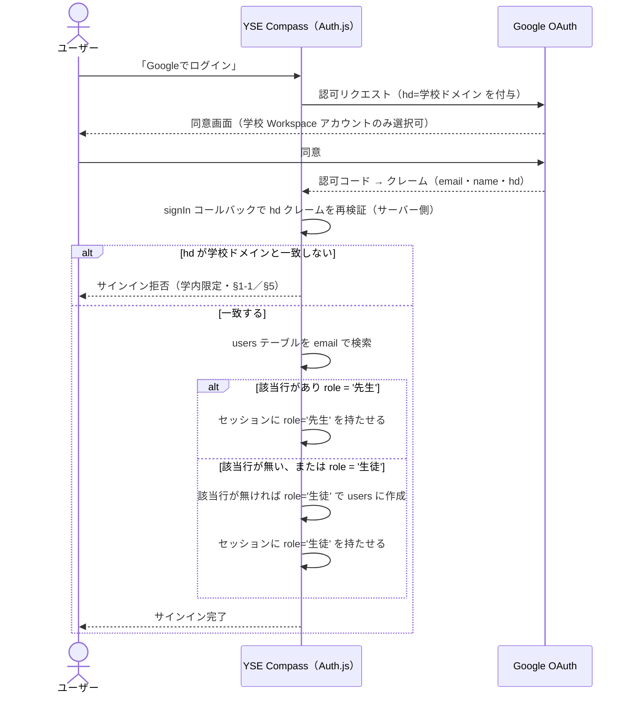

# 07. 外部インターフェース設計

> **位置づけ**：Google Workspace / Drive と、どこで・どの権限で・何をやり取りするかを答える
> **確度**：**暫定（レビュー未了）**
> **正典**：このファイル
> **更新のしかた**：上書き
> **主担当**：蒲山・水戸
> **最終更新**：2026-09-11（蒲山・7-2 ロール解決を執筆。H-10・H-11 決着分を反映。OAuth 可否検証・7-1／7-3〜7-5 は未着手のまま）

## この章が答える問い

**実体レス設計（`../requirements.md` §1-1）の帰結として、本システムは外部と何を交換するのか。** ファイルを持たない以上、外部 IF の設計がそのままプロダクトの成立条件になる。

## 書くもの

| # | 成果物 | 形式 |
| --- | --- | --- |
| 7-1 | 外部 IF 一覧 | 表（相手 ／ 方式 ／ 方向 ／ 認証 ／ 失敗時の挙動） |
| 7-2 | Google OAuth（Auth.js） | シーケンス図＋取得するクレーム＋**ロールの解決方法** |
| 7-3 | Google Drive 連携 | **Stage 1（リンク登録）の仕様**と、Stage 2（API 統合）採用時の差分 |
| 7-4 | URL の検証方針 | 形式検証のみ・アクセス可否は検証しない（2026-07-26）の実装方針 |
| 7-5 | 外部障害時の挙動 | Drive のリンク切れ・Google 側の停止時に画面がどう見えるか |

## 書かないもの

| 書かないこと | 参照先 |
| --- | --- |
| 認可（誰が何をできるか）の設計 | `09-nfr.md` |
| 提出リンクの格納形式 | `06-data.md` |
| Drive 側の運用ルール | **Drive 運用マニュアル**（ヒヤリング後に作成する運用成果物・未作成） |

## 埋まる条件

**部分的に書ける。Stage 1 前提なら 7-3・7-4 は書ける。7-2 は「ロール解決」の部分だけ書ける状態になった（2026-09-11 執筆）。**

**2026-09-05：7-2 のうちロール解決の方式は決着した**（先生ホワイトリスト方式・`../decisions.md`）。**2026-09-06：ホワイトリストの1人目の投入方法も決着した**（H-11・`../decisions.md`）。サインイン後に先生か生徒かをどう決めるかは下記のとおり書けるようになった。7-2 に残るのは **OAuth 自体の技術検証**（未実施）と、下表の Drive 側（H-12・H-13・#10）。

| 障害 | 内容 | 影響する箇所 |
| --- | --- | --- |
| **H-12** | 未決 #10 の「統合の範囲」が、**OAuth スコープの選択と同じ問題**だと接続されていない。**技術検証済み（`../findings.md` F-03）**：`drive.file` は Google 検証不要、`drive`/`drive.readonly` は学内限定でも検証必須 | 7-2・7-3 |
| **H-13** | Drive 内提出と Drive 外提出（Canva・動画）が**同じ資料枠に同居**する構図が未設計 | 7-3 |
| **#10** | Drive 統合の範囲そのもの | 7-3（Stage 1 で先行可） |
| **技術検証未実施** | Auth.js × 学校 Google アカウントの **OAuth 可否**。`../requirements.md` §5 が「**最大の技術リスク**」と明記。期日 8/20 を超過し、着手されていない | 7-2 の実現可能性そのもの（下記のロール解決とは別の障害） |
| **D-4（未起票）** | 企画書は本番環境候補に**イントラネット管理**を挙げているが、Google OAuth は外部 IdP への到達が前提。**両立するか誰も検証していない** | 7-2・`08-architecture.md` |

> **OAuth の疎通そのものは、依然として設計以前に検証が要る。** 下記 7-2 は「疎通した後、ロールをどう決めるか」だけを扱う。「通らなかった場合の代替」を持たないまま設計書を出すと、実装フェーズで根本からやり直しになる。

## 7-2. Google OAuth（Auth.js）— ロール解決

**対応要件**：`../requirements.md` §3-6（ログイン・ロール管理）・§5（技術的制約・認証）／`../glossary.md` §3 ユーザーとロール
**設計判断の出典**：`../decisions.md` 2026-09-05（H-10 決着）・2026-09-06（H-11 決着）

### サインイン〜ロール確定のシーケンス

### 取得するクレーム

| クレーム | 用途 |
| --- | --- |
| `email` | `users.email`（`design/06-data.md` 6-3）と突き合わせてロールを解決する一次キー |
| `name` | `users.name` に保存し、実名表示（`../requirements.md` §4 セキュリティ）に使う |
| `hd`（hosted domain） | 学校 Workspace ドメインでのサインインであることの確認。**Google が返すクレームをそのまま信用せず、サーバー側の `signIn` コールバックで再検証する**（`hd` はクライアント側の認可リクエストパラメータでもあるため、なりすまし防止にはコールバック側の検証が要る） |

### ロールの解決方法（H-10 決着分）

1. **先生だけを事前登録するホワイトリスト方式。** `users.role`（`design/06-data.md` 6-3）が `'先生'`／`'生徒'` の2値を持つこと自体がホワイトリストであり、別テーブルは持たない
2. **サインイン時に email で `users` を検索する。** 該当行が既にあり `role='先生'` なら先生としてセッションを張る。該当行が無い場合は `role='生徒'` で新規作成する（初回サインインで自動登録）
3. **メールアドレスのパターンによる判定は行わない。** 判定材料は「事前登録された先生の email と一致するか」だけ（`../decisions.md` 2026-09-05）
4. **誤判定は必ず安全側（先生が生徒として扱われる）に倒れる。** 権限昇格は起きない設計であることが、この解決方法の成立条件

### ホワイトリストの1人目（H-11 決着分）

- **運用開始時に DB へ直接投入する**（投入対象：冨永先生）。以後の追加は SC-20「先生の登録・解除」画面経由のみ
- **ホワイトリストを空にできない**という不変条件があり、その実現として「自分自身のロールは解除できない」という規則を置く（`../decisions.md` 2026-09-06）
- **投入先のテーブル・列の確定は `design/06-data.md`（`users` テーブル）に依存する。** 現時点では6-3の`users.role`列への直接 INSERT を想定しているが、実際の投入手順（SQL／マイグレーションのシード）は `design/10-operation.md` 10-2 で確定させる（未着手）

### この節に残る前提・未決

- **前提**：サインインできるのは学校 Workspace ドメインのアカウントのみであること（`../requirements.md` §5・§1-1）。**この前提が崩れると本節の設計ごと成立しない**
- **未決 #8**：先生ロールの親子二層構造の要否。本節は**単層前提**（`role` が2値）で書いている。#8 が決着すると本節の「ロールの解決方法」に列・分岐が増える可能性がある
- **未検証**：Auth.js の `signIn` コールバックで `hd` を再検証する実装、および Google Workspace 側でこのアプリの OAuth 同意自体が通るかは、依然として `../requirements.md` §5 の技術検証（未実施）の範囲

## 現在の状態

**部分的に書けた（2026-09-11）。** 7-2 のうち「ロール解決」は執筆済み。**7-2 に残るのは OAuth 自体の技術検証**（未実施・別作業として並行中）。7-1・7-3・7-4・7-5 は未着手のまま（7-3・7-4 は Stage 1 前提で先行できる）。
