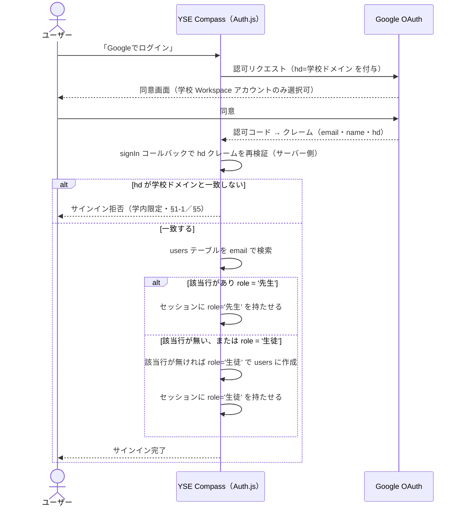

# 07. 外部インターフェース設計

> **位置づけ**：Google Workspace / Drive と、どこで・どの権限で・何をやり取りするかを答える
> **確度**：**暫定（レビュー未了）**
> **正典**：このファイル
> **更新のしかた**：上書き
> **主担当**：蒲山・水戸
> **最終更新**：2026-09-11（蒲山・7-1 外部IF一覧・7-5 外部障害時の挙動を執筆。全節（7-1〜7-5）が本文ありになった）／2026-09-11（蒲山・7-3 Drive連携（Stage 1）・7-4 URL検証方針を執筆。7-2 にF-04（OAuth疎通検証）を反映。7-1・7-5 は未着手のまま）／2026-09-11（蒲山・7-2 ロール解決を執筆。H-10・H-11 決着分を反映。OAuth 可否検証・7-1／7-3〜7-5 は未着手のまま）

## この章が答える問い

**実体レス設計（`../requirements.md` §1-1）の帰結として、本システムは外部と何を交換するのか。** ファイルを持たない以上、外部 IF の設計がそのままプロダクトの成立条件になる。

## 書くもの

| # | 成果物 | 形式 |
| --- | --- | --- |
| 7-1 | 外部 IF 一覧 | 表（相手 ／ 方式 ／ 方向 ／ 認証 ／ 失敗時の挙動） |
| 7-2 | Google OAuth（Auth.js） | シーケンス図＋取得するクレーム＋**ロールの解決方法** |
| 7-3 | Google Drive 連携 | **Stage 1（リンク登録）の仕様**と、Stage 2（API 統合）採用時の差分 |
| 7-4 | URL の検証方針 | 形式検証のみ・アクセス可否は検証しない（2026-07-26）の実装方針 |
| 7-5 | 外部障害時の挙動 | Drive のリンク切れ・Google 側の停止時に画面がどう見えるか |

## 書かないもの

| 書かないこと | 参照先 |
| --- | --- |
| 認可（誰が何をできるか）の設計 | `09-nfr.md` |
| 提出リンクの格納形式 | `06-data.md` |
| Drive 側の運用ルール | **Drive 運用マニュアル**（ヒヤリング後に作成する運用成果物・未作成） |

## 埋まる条件

**全節（7-1〜7-5）が本文ありになった。** 残存未決は下表のみで、章自体はここで完結する（#10・H-19の決着時に7-3・7-5へ差分追記が要る）。

**2026-09-05：7-2 のうちロール解決の方式は決着した**（先生ホワイトリスト方式・`../decisions.md`）。**2026-09-06：ホワイトリストの1人目の投入方法も決着した**（H-11・`../decisions.md`）。**2026-09-11：OAuth 自体の疎通も一次検証済み**（`../findings.md` F-04）。

| 障害 | 内容 | 影響する箇所 |
| --- | --- | --- |
| **H-12** | 未決 #10 の「統合の範囲」が、**OAuth スコープの選択と同じ問題**だと接続されていない。**技術検証済み（`../findings.md` F-03）**：`drive.file` は Google 検証不要、`drive`/`drive.readonly` は学内限定でも検証必須 | 7-3（Stage 2 の差分として反映済み） |
| **H-13** | Drive 内提出と Drive 外提出（Canva・動画）が**同じ資料枠に同居**する構図が未設計 | 7-3（Stage 1 では区別が不要と整理済み。Stage 2 移行時に残る） |
| **#10** | Drive 統合の範囲そのもの | 7-3（Stage 1 で書き切った。決着後に Stage 2 差分の追記が要る） |
| **H-19** | 「リハーサル段階の確認運用」の実在が未確認 | 7-4（アクセス可否を検証しない代わりの担保先） |
| **本番投入可否の検証** | Auth.js × 学校 Google アカウントの OAuth は**一次検証済み**（F-04）だが、本番リダイレクトURI・学校組織のCloudプロジェクト・第三者アプリ許可ポリシーは未検証 | 7-2 |
| **D-4（未起票）** | 企画書は本番環境候補に**イントラネット管理**を挙げているが、Google OAuth は外部 IdP への到達が前提。**両立するか誰も検証していない** | 7-2・`08-architecture.md` |

## 7-1. 外部 IF 一覧

**対応要件**：`../requirements.md` §1-1（実体レス）・§5（技術的制約）

本システムが境界の外とやり取りする相手は、実体レス設計（§1-1）の帰結として**2つだけ**に絞られる。

| 相手 | 方式 | 方向 | 認証 | 失敗時の挙動 |
| --- | --- | --- | --- | --- |
| Google（サインイン。Google Identity のOAuth 2.0 / OIDC） | Auth.js経由のリダイレクトフロー（サーバー主導） | アプリ→Google→アプリの往復（サーバー間通信を含む） | クライアントID／シークレット（アプリ側が保持）。`hd`クレームをサーバー側で再検証（7-2） | サインインが完結せずエラーで終わる。代替手段は無い（7-5） |
| Drive・Canva・動画配信サービス等（提出物のリンク先） | ブラウザによる別タブ遷移（リンククリック）。**サーバー間のAPI通信は行わない**（Stage 1・7-3） | ユーザーのブラウザ→リンク先（アプリのサーバーは経由しない） | リンク先ごとの権限設定に依存。アプリは関与しない（7-4） | システムはリンク先の状態を検知しない。開けるかはユーザーが実際に開くまで分からない（7-5） |

**Stage 2（#10決着後）で増える可能性がある相手**：Google Drive API（サーバー間のAPI通信）。現時点では上表に含めない（7-3）。

**含まれないもの**：メール・プッシュ通知の送信基盤（`requirements.md` §3-2「通知送信はスコープ外」）、決済・外部の学籍システム連携（正典に無い）。

## 7-2. Google OAuth（Auth.js）— ロール解決

**対応要件**：`../requirements.md` §3-6（ログイン・ロール管理）・§5（技術的制約・認証）／`../glossary.md` §3 ユーザーとロール
**設計判断の出典**：`../decisions.md` 2026-09-05（H-10 決着）・2026-09-06（H-11 決着）

### サインイン〜ロール確定のシーケンス

### 取得するクレーム

| クレーム | 用途 |
| --- | --- |
| `email` | `users.email`（`design/06-data.md` 6-3）と突き合わせてロールを解決する一次キー |
| `name` | `users.name` に保存し、実名表示（`../requirements.md` §4 セキュリティ）に使う |
| `hd`（hosted domain） | 学校 Workspace ドメインでのサインインであることの確認。**Google が返すクレームをそのまま信用せず、サーバー側の `signIn` コールバックで再検証する**（`hd` はクライアント側の認可リクエストパラメータでもあるため、なりすまし防止にはコールバック側の検証が要る） |

### ロールの解決方法（H-10 決着分）

1. **先生だけを事前登録するホワイトリスト方式。** `users.role`（`design/06-data.md` 6-3）が `'先生'`／`'生徒'` の2値を持つこと自体がホワイトリストであり、別テーブルは持たない
2. **サインイン時に email で `users` を検索する。** 該当行が既にあり `role='先生'` なら先生としてセッションを張る。該当行が無い場合は `role='生徒'` で新規作成する（初回サインインで自動登録）
3. **メールアドレスのパターンによる判定は行わない。** 判定材料は「事前登録された先生の email と一致するか」だけ（`../decisions.md` 2026-09-05）
4. **誤判定は必ず安全側（先生が生徒として扱われる）に倒れる。** 権限昇格は起きない設計であることが、この解決方法の成立条件

### ホワイトリストの1人目（H-11 決着分）

- **運用開始時に DB へ直接投入する**（投入対象：冨永先生）。以後の追加は SC-20「先生の登録・解除」画面経由のみ
- **ホワイトリストを空にできない**という不変条件があり、その実現として「自分自身のロールは解除できない」という規則を置く（`../decisions.md` 2026-09-06）
- **投入先のテーブル・列の確定は `design/06-data.md`（`users` テーブル）に依存する。** 現時点では6-3の`users.role`列への直接 INSERT を想定しているが、実際の投入手順（SQL／マイグレーションのシード）は `design/10-operation.md` 10-2 で確定させる（未着手）

### この節に残る前提・未決

- **前提**：サインインできるのは学校 Workspace ドメインのアカウントのみであること（`../requirements.md` §5・§1-1）。**この前提が崩れると本節の設計ごと成立しない**
- **未決 #8**：先生ロールの親子二層構造の要否。本節は**単層前提**（`role` が2値）で書いている。#8 が決着すると本節の「ロールの解決方法」に列・分岐が増える可能性がある
- **一次検証済み**（`../findings.md` F-04・2026-09-11）：個人の Google Cloud プロジェクト（内部・Internal）とローカル環境の最小構成で、`signIn` コールバックの `hd` 再検証を含めた実装で `@yse-c.net` アカウントのサインインが成功した。**本番投入可否**（本番リダイレクトURI・学校組織としてのCloudプロジェクト・第三者アプリ許可ポリシー）は依然として `../requirements.md` §5 の検証範囲

## 7-3. Google Drive 連携 — Stage 1（リンク登録）の仕様

**対応要件**：`../requirements.md` §1-1（実体レス）・§3-4（資料提出・差し替え）／`../glossary.md` §3 クラス（Drive ディレクトリ構成）
**先行方針の出典**：`../open-questions.md` #10（Stage 1＝所定フォルダへの運用配置＋リンク登録）

### Stage 1 の範囲

**本システムは Drive を一切操作しない。** API 連携・OAuth スコープ要求・フォルダ自動生成のいずれも行わない。システムが持つのは `submissions.url`（`design/06-data.md` 6-3）という**1本のリンク文字列**だけで、その値が Drive を指しているか、Canva や動画配信サービスを指しているかを区別しない

### 運用フロー（アプリの外側で完結する部分）

1. 先生・生徒は、学校側で運用しているディレクトリ構成（年度 → 工業2年 → 卒業制作 → 発表名 → クラス略称。`glossary.md` §3）に、既存の Drive 運用ルールに従ってファイルを配置する
2. 生徒は配置したファイル（または Canva・動画等の外部サービス）の共有リンクを取得する
3. アプリの提出フォームにそのリンクを貼り付ける（`submissions.url` へ保存。§7-4 の形式検証のみ通す）

**1・2 はアプリの外側の運用**（Drive 運用マニュアル・未作成）であり、本章は 3 から先だけを扱う（「書かないもの」参照）

### H-13（Drive内提出とDrive外提出の混在）への回答 — Stage 1では区別が要らない

`glossary.md` H-13 は「同じ資料枠に Drive 配置と外部 URL 登録が混在する」ことを構造上の未設計としているが、**Stage 1 の設計はこの混在を前提に成立している**。`submissions.url` は文字列でしかなく、Drive のリンクか Canva のリンクかによって処理を分岐させない。H-13 が実際に効いてくるのは **Stage 2（API 統合）でシステムが Drive 側を操作しようとしたとき**であり、それまでは分岐そのものが発生しない

### Stage 2（API 統合）採用時の差分（#10 決着後）

- 要求スコープは `findings.md` F-03 の技術検証により **`drive.file` を既定候補とする**（Google の restricted scope 検証を要さない。`drive`/`drive.readonly` は学内限定でも検証必須）
- Google Picker API と組み合わせ、生徒がアプリ内から Drive のファイルを選択する導線に置き換わる可能性がある
- **Drive の外に実体があるもの（Canva・動画）は Stage 2 でも自動化の対象外**（H-13 は解消しない。Stage 2 後も「Drive 内提出」と「外部 URL 登録」の2経路が残る）
- この差分は **#10 が決着してから設計する**。現時点では Stage 1 の仕様を実装対象とする

## 7-4. URL の検証方針

**対応要件**：`../requirements.md` §3-4（提出フォームは URL の形式検証のみ行う。アクセス可否は検証しない）
**設計判断の出典**：`../decisions.md` 2026-07-26

### 検証すること・しないこと

| 項目 | 検証する／しない | 実装方針 |
| --- | --- | --- |
| URL の構文（スキーム・ホストを持つ妥当な形式か） | **する** | `submissions.url`（6-3）・`material_slots.template_url`（6-3）の入力時に URL パーサー（例：`URL` コンストラクタ・zodの `.url()`）で構文検証する。**予防の下限**（`requirements.md` §3-4） |
| スキームの制限（`https://` 限定にするか） | **する（推奨）** | `http://` を許可する積極的理由が正典に無いため、`https://` のみを許可する。将来ゆるめる分には後方互換 |
| リンク先へのアクセス可否（開けるか・権限があるか） | **しない** | `requirements.md` §3-4「システムと先生でアクセス文脈が異なり技術的に不確実」。実装として **HEAD リクエストや到達確認を一切行わない** |
| リンク先が Drive かどうか（ドメイン制限） | **しない** | Canva・動画等、Drive 以外の URL を許容する（§1-1「形式に依存せず全対応できる」の帰結）。ドメインでのホワイトリスト化はしない |

### アクセス可否を検証しない代わりに何が担保するか

- **リハーサル段階の確認運用**（`requirements.md` §3-4）に委ねる。ただし**この運用の実在が未確認**（`open-questions.md` H-19）であり、本章はその前提の上に立っている。H-19 が「実在しない」で決着した場合、本節の「検証しない」という設計判断自体は変わらないが、アクセス不可のリンクが発表当日まで発覚しない事故の担保先が空白のまま残る
- **#10（Drive API 統合）が採用されれば、Drive API でアクセス可否を再判断できる**（`requirements.md` §3-4）。Stage 1 ではこの手段が無い

### 失敗時の挙動

- 形式検証に失敗した場合：提出フォームでエラーを表示し、送信させない（クライアント・サーバー双方で検証）
- 形式は正しいが実際には開けないリンクだった場合：**システムは検知しない。** §3-5 の閲覧機能（別タブで開く）を生徒・先生が実際に試すまで発覚しない

## 7-5. 外部障害時の挙動

**対応要件**：`../requirements.md` §4 データ保持・アーカイブ（リンク切れ検知はシステムで持たない・2026-07-26）
**設計原則の出典**：`../requirements.md` §3 冒頭（状態遷移は先生の明示操作を正とし、時刻・条件による自動遷移は持たない）

7-1 が挙げた2つの外部IF（Google サインイン／リンク先）は、障害時の性質がまったく異なる。**片方は全ユーザーを止め、もう片方は誰も気づかないまま進む。**

### Google（サインイン基盤）が止まった場合

- **影響範囲：全ユーザー。** サインインができないため、公開済みの資料閲覧を含め、アプリの機能に一切到達できない（学内限定・認証必須のため未認証の代替導線を持たない・`requirements.md` §1-1）
- **画面の見え方**：Auth.js の既定のエラー画面（サインインに失敗した旨）が表示される。**カスタムのフォールバック画面・代替認証手段は設計しない** — 単一の認証基盤に依存すること自体が可用性の要件（G-2・`open-questions.md`）の領分であり、本節はそれを前提として受け入れる
- **自動復旧**：Google 側の復旧を待つ以外に手段が無い。システム側から打てる手は無い（設計原則：自動遷移を持たない、の裏面としての「自動復旧も持たない」）

### リンク先（Drive・Canva・動画配信サービス等）が開けない場合

- **影響範囲：そのリンクを開こうとした人だけ。** 提出自体はメタデータ（URL文字列）の登録で完結しているため（§1-1 実体レス）、リンク先の障害はアプリの他の機能に波及しない
- **画面の見え方：変わらない。** §3-5 の閲覧画面はリンクが「登録されている」ことしか知らず、開けるかどうかを検知しない（7-4）。クリックした先でブラウザ・Drive側のエラー（404・403等）が表示されるだけで、**アプリの画面はそれを検知も表示もしない**
- **リンク切れの永続化**：`requirements.md` §4 の決定どおり、自動検知・自動修復は行わない。実体側の安定は「Drive 運用マニュアル」（ヒヤリング後作成・未作成）に委ねる（「書かないもの」参照）

### この節が置かない設計

- **リトライ・サーキットブレーカー**：Stage 1 ではサーバー間のAPI通信がリンク先に対して存在しない（7-3）ため、そもそも設計対象が無い
- **障害時の代替ページ・メンテナンスモード**：正典に根拠が無く、本番環境（`requirements.md` §5・未確定）が固まってから `08-architecture.md` の領分として検討する

## 現在の状態

**7-1〜7-5すべて執筆済み**（2026-09-11）。**7-2 に残るのは OAuth の本番投入可否の検証**（一次検証は`findings.md` F-04で完了）。7-3・7-5は#10（Drive統合の範囲）決着後に差分追記が要る。全体の確度は「暫定」のまま（水戸のレビュー未了）。
