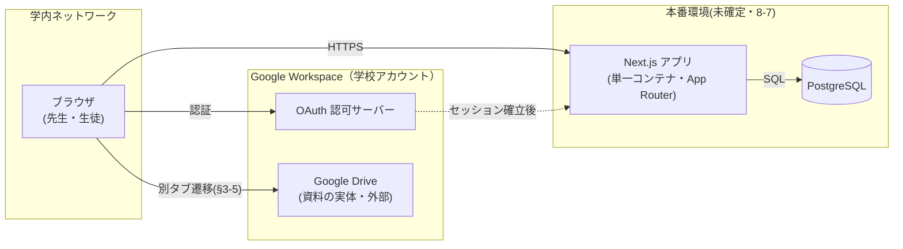
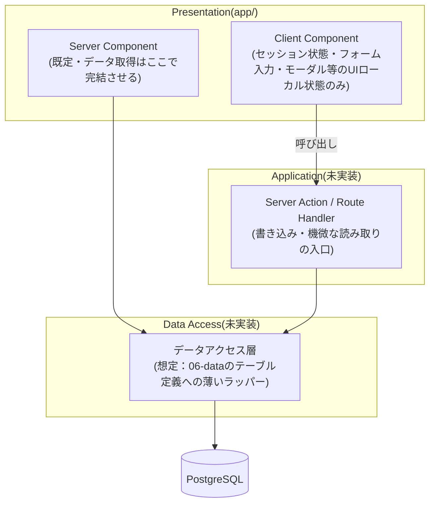

# 08. 方式設計

> **位置づけ**：どの技術で、どんな層構成で、どこに置いて動かすかを答える
> **確度**：**暫定（レビュー未了）**
> **正典**：このファイル（**技術スタックの一覧は `../../CLAUDE.md` §5**）
> **更新のしかた**：上書き
> **主担当**：蒲山
> **最終更新**：2026-09-05（水戸・H-17 決着＝Prisma 採用を 8-1 へ反映／蒲山・K3 決着分を 8-1 へ反映）

## この章が答える問い

**要件を成立させる技術的な骨格は何か。** 機能設計（03）が「何をするか」なら、この章は「何の上で動くか」。

## 書かないもの

| 書かないこと | 参照先 |
| --- | --- |
| 技術スタックの一覧そのもの | `../../CLAUDE.md` §5（**再掲しない。採用理由だけ書く**） |
| 性能・可用性の目標値 | `09-nfr.md` |
| Google との IF | `07-interface.md` |

> **バッチ・スケジューラの節は置かない。** 設計原則「状態遷移は先生の明示操作を正とし、時刻・条件による自動遷移は持たない」（`../requirements.md` §3 冒頭）の帰結として、設計に存在しない。

---

## 8-1. 技術スタックと採用理由

| 層 | 採用 | バージョン方針 | 採用理由 | 出典 |
| --- | --- | --- | --- | --- |
| 言語 | TypeScript（strict） | Ph.2 で `package.json` 固定 | Next.js 標準構成。`strict` により実装時の型不整合を設計段階の意図から検出できる | `tsconfig.json`（`../../CLAUDE.md` §5 はフレームワークとしての TypeScript 採用のみを定め、`strict` 化は実装側の判断） |
| フレームワーク | Next.js 16（App Router） | 同上 | 要件の中心は CRUD とメタデータ表示（実体レス・§1-1）で、Server Component 優先の App Router により API 層を薄く保てる | `package.json`（`../../CLAUDE.md` §5 は Next.js 採用のみを定め、具体バージョンは「Ph.2 で固定」としか言っていない） |
| UI ライブラリ | React 19 ＋ React Compiler 有効 | 同上 | 手動メモ化（`useMemo`/`useCallback`）を書かずに再描画コストを抑制できる。`next.config.ts` の `reactCompiler: true` で有効化済み | `package.json`・`next.config.ts`（**React Compiler の採用は `../../CLAUDE.md` §5・企画書 §2-3 いずれにも記載が無い。`../open-questions.md` H-18 参照**） |
| スタイル | Tailwind CSS 4 | 同上 | ユーティリティクラスで完結し、画面数が多い割にデザインシステムを別途持つ規模ではない | `package.json`（**採用は `../../CLAUDE.md` §5・企画書 §2-3 いずれにも記載が無い。`../open-questions.md` H-18 参照**） |
| DB | PostgreSQL 16（Docker イメージ `postgres:16-alpine`） | 同上 | `../../CLAUDE.md` §5 の確定採用。関係モデルで足りるデータ形状（06 データ設計は未着手のため詳細は未定） | `../../CLAUDE.md` §5・`docker-compose.yml` |
| DB アクセス | **Prisma**（2026-09-05 に採用決定・**未導入**） | Ph.2 で `package.json` 固定 | `../../CLAUDE.md` §5・企画書 §2-3 の正典どおり。導入は W13（9/11〜）。疎通確認の `pg` 直接使用は暫定で、業務データのアクセス層には持ち込まない。下記「ORM の採用方針」参照 | `../decisions.md`（2026-09-05）・`src/app/api/health/db/route.ts`（現状の実装） |
| PDF 生成 | 純粋 JS の PDF ライブラリ（ヘッドレスブラウザ非依存） | 銘柄は実装着手時に確定 | Chromium 同梱を避ける（K3 検証・`../decisions.md` 2026-09-04） | `../decisions.md`・`05-output.md` 5-4 |
| 認証 | Auth.js ＋ Google Workspace OAuth（未実装・未検証） | 検証は設計フェーズ後半 | 学校 Google アカウントとの統合が前提。**OAuth が通るかが最大の技術リスク** | `../requirements.md` §5 |
| パッケージマネージャ | pnpm | — | `../../CLAUDE.md` 既定 | `../../CLAUDE.md` |
| バンドラ | **Turbopack（固定）** | — | dev と build で別のバンドラを通る状態を作らない。既定に頼らず `--turbopack` を明示する（8-6・`../findings.md` **F-02**） | `package.json` |
| 開発環境 | **Docker は PostgreSQL のみ**／Next.js アプリはホスト直起動 | — | アプリをコンテナに入れたことだけが原因の問題（バインドマウント越しのファイル監視・`.next` の所有者・バンドラの使い分け）を設計から消す（8-6・`../findings.md` **F-02**） | `docker-compose.yml` |

### ORM の採用方針 — 2026-09-05 に Prisma 採用で決着（旧 監査 M-1 → H-17）

**決定：DB アクセスの ORM は Prisma を採用する**（`../decisions.md` 2026-09-05・未決 H-17 の決着）。06 データ設計のテーブル定義は Prisma のスキーマ駆動（マイグレーション・型生成）で実装へ落とす。**`pg` の直接使用は DB 疎通確認エンドポイント（`src/app/api/health/db/route.ts`）に限った暫定であり、業務データのアクセス層には持ち込まない。**

**これは正典どおりに戻す決定であって、正典の変更ではない。** `CLAUDE.md` §5 の Prisma は独自の技術選定ではなく、**企画書 §2-3「ソフトウェア構成」に明記された凍結済み Ph.0 成果物**（先生に説明済み）が出どころで、逸脱するなら対外的な説明責任が発生する。

- **乖離の経緯**：`main` の実装が `pg` 直接で始まっていた乖離は 2026-09-03 の三者整合性監査で M-1 として見つかっていたが `open-questions.md` への起票が漏れており、本章の執筆時に実物を再確認して H-17 として正式に昇格させた（`../findings.md` F-01）。**起票から決着まで 1 日。**
- **現状の性質**：`main` の `src/` は DB 疎通確認用の 1 エンドポイントのみで、業務データへのアクセス層はまだ存在しない（`src/lib/mock/*` 等のモックデータは鈴木さんの `feature/mock`（未マージ）側にある）。**切り替えコストが最小の時点で決めた**
- **スケジュール**：現行スケジュールの **W13（9/11〜9/17）が「DB接続・Prisma セットアップ・マイグレーション」を前提に組まれている**。本決定は期限 9/11 に対して先行している
- **明示しておく留保**：**W9 に予定されていた Prisma の技術検証は未実施**で、本決定は**未検証のまま正典に従う**判断である。検証で不成立が判明した場合は `../decisions.md` へ【変更】として追記する
- **この決定が効く先**：本表の「DB アクセス」行（反映済み）・`06-data.md` のスキーマ定義の書式（未着手）。`../../CLAUDE.md` §5 の ORM 行は**元から Prisma なので変更不要**

---

## 8-2. システム構成図



- **構成要素はブラウザ・Next.js アプリ・PostgreSQL の3つのみ。** メッセージキュー・キャッシュ層・バッチサーバーは置かない（設計原則の帰結）
- **Google Drive は資料の実体置き場であり、アプリからは直接アクセスしない**（Stage 1＝リンク登録・`../open-questions.md` #10）。ブラウザから別タブで直接遷移する（`../requirements.md` §3-5）
- **Google OAuth との接続は認証（ログイン）時のみ**発生し、以降のリクエストはアプリのセッションで完結する（Auth.js の標準パターン）

---

## 8-3. アプリケーション層構成



- **責務分界の原則**：一覧・詳細等の**読み取り**は Server Component が Data Access 層を直接呼ぶ。**書き込みと機微な読み取り**（ロール判定が要るもの）は必ず Server Action / Route Handler を経由させ、そこで権限判定を行う。画面側の表示制御は二次的な UX であって防御ではない（`../open-questions.md` **H-16** 先行方針をそのまま適用）
- **現状の実態との差分**：`main` の `src/` は DB 疎通確認（`api/health/db/route.ts`）と雛形の4ファイル（`layout.tsx`／`page.tsx`／`globals.css`／`favicon.ico`）のみで、Data Access 層・Server Action 層は存在しない。**`src/lib/mock/*`・`SessionContext`・`AuthGuard`・`RoleGate` は、鈴木さんの `feature/mock`（未マージ）に実装されているモックであり、`main` にはまだ無い。** 統合後の実態としては、すべての画面が `src/lib/mock/*` のインメモリ配列を直接参照し、認可も `SessionContext`（`localStorage` の persona 切り替え）による**クライアント側の見た目の出し分けのみ**という、H-16 が指摘する状態そのものになる見込み。06 データ設計の骨格が引けた時点（K2）で、Data Access 層と Server Action の導入に着手する
- **Client Component の範囲は限定する**：セッション状態、認証ガード、ロールに応じた表示切り替え、フォームの入力状態、モーダル・確認ダイアログの開閉。**一覧・詳細のデータ取得を Client Component 側で行わない**（Server Component 優先の原則・8-4）。`feature/mock`（未マージ）はこの範囲を `SessionContext`／`AuthGuard`／`RoleGate` として実装しており、統合後の実装もこの3コンポーネントの役割分担を踏襲する想定

---

## 8-4. 状態管理とデータ取得の方針

- **原則**：Server Component を既定とし、取得したデータはページ単位で完結させる。グローバルなクライアント状態管理ライブラリ（Redux・Zustand 等）は導入しない — 要件の大半は「一覧を見る・フォームを送る」の単純な往復で、状態管理の複雑さに見合う UI 遷移が無い
- **Client Component が持ってよい状態**：認証セッション（`feature/mock`（未マージ）実装では `SessionContext`）、フォームの未送信入力、UI のローカルな開閉状態のみ。**サーバーから取得したデータのキャッシュや同期はクライアント側で持たない**
- **再検証（revalidate）のタイミング**：
  - 通常の一覧・詳細画面は、遷移・再読み込み時の Server Component 再実行で最新化する（Next.js の既定動作）
  - 当日タイムテーブルの進行状態のみ特別扱いが要る（8-5）

---

## 8-5. 当日進行の伝播方式

- **要件**：`../requirements.md` §3-10。先生が「発表中」を切り替えると、聴く生徒の画面へ反映する必要がある
- **確定（2026-09-04・#4 決着）**：**ポーリング**。生徒側のタイムテーブル画面が、一定間隔で当日進行状態のみを再取得する（`../decisions.md` 同日）
  - **根拠①（規模）**：伝播対象は「発表中の発表」と「発表順・時刻枠」だけで、同時 120 名でも要求レートは十数 req/s のオーダー。判断基準（2026-07-24 言語化）の第 1 分岐「規模が問題にならない」に落ちる
  - **根拠②（本番環境）**：**本番環境が未確定**（`../requirements.md` §5）である以上、接続を張り続ける SSE・WebSocket は**ホスティング形態に賭けることになる**。WebSocket は App Router 単体では張れず別プロセス（コネクション管理）が要り、Docker 構成と 8-7 が変わる。ポーリングは通常の HTTP リクエストなので、どの形態でも成立する（`../../CLAUDE.md` 禁則5）
- **未確定：ポーリング間隔の値。** 根拠になるのは**許容遅延**（生徒が自分の出番に気づける遅れの上限）で、これが正典に無い。発表 1 コマの所要時間から導ける → `../open-questions.md` §6 保留
  - **応答時間目標（`../requirements.md` §4 性能・2026-09-05 確定）とは別の指標。** 応答時間は「1 リクエストが返る速さ」、間隔は「データが最大どれだけ古くてよいか」。9-1 で混ぜない
- **実装の先行方針**：暫定間隔で組む。**間隔を 1 箇所の定数に置き**、決定後に差し替えられる形にする
- **未決 ID**：`../open-questions.md` **§6 保留**（間隔の値）

---

## 8-6. 開発・実行環境

**Docker で管理するのは PostgreSQL のみ。Next.js アプリはホストで直接起動する**（2026-09-04 決定・`../decisions.md`）。

### Docker 構成

- `docker-compose.yml`：`db`（`postgres:16-alpine`）の **1 サービスのみ**。データは名前付きボリューム `db_data` に永続化し、`pg_isready` で healthcheck する
- **アプリ用のコンテナと `Dockerfile` は持たない。** バインドマウント越しのファイル監視・`.next` の所有者問題・バンドラの使い分けといった、**アプリをコンテナに入れたことだけが原因の問題**を設計から消すため（`../findings.md` **F-02**）
- 企画書 §3-1 の「Docker＝チーム内で開発環境を統一する道具」は、**揃える必要があるのは DB のバージョンとデータ**であるため、DB のみの管理で満たされる
- **Node のバージョンは `.nvmrc`（`24`）で固定する。** アプリをコンテナから出したことで Docker による Node の固定が外れるため、その代替。CI も `.nvmrc` を読む
- **pnpm のバージョンは `package.json` の `packageManager`（`pnpm@11.17.0`）で固定する。** 旧 `Dockerfile` の `corepack enable` が担っていた役割の明示化。corepack と CI の双方がこの値を読む

### バンドラ

- **Turbopack に固定する。** `package.json` の `dev` / `build` に `--turbopack` を明示する
- 既定値に頼らず明示するのは、**dev と build で別のバンドラを通る状態を作らない**ため。Next.js 16 はどちらも Turbopack が既定だが、既定は将来変わりうる（`../findings.md` **F-02**）

### 環境変数

- `.env.example` をコピーして `.env` を作成（`POSTGRES_USER` / `POSTGRES_PASSWORD` / `POSTGRES_DB` / `DATABASE_URL`）
- **`DATABASE_URL` のホスト名は `localhost`。** アプリはホストから起動し、`db` サービスが公開する 5432 番へ繋ぐ。**`.env.local` による上書きは不要**（手順が 1 つになったため）

### ローカル起動手順

```bash
cp .env.example .env
docker compose up -d db
pnpm install
pnpm dev
```

- 疎通確認：`http://localhost:3000/api/health/db` が `{"status":"ok"}` を返せば DB 接続成功
- 停止は `docker compose down`。データは `db_data` に残る。データごと消すなら `docker compose down -v`

### 既存環境からの移行（2026-09-04 の変更に伴い 1 回だけ必要）

**アプリを Docker で動かしていた期間があるため、旧構成の残骸が 3 つ残る。** いずれも実機で確認済み。

| 残骸 | 症状 | 対処 |
| --- | --- | --- |
| 旧 `app` コンテナ | compose から消えても**コンテナは残り、3000 番を掴み続ける**。ホストで `pnpm dev` すると 3001 番へ退避し、ブラウザは古いコンテナを見る | `docker compose up -d db --remove-orphans` |
| 既存の `.env` | `DATABASE_URL` が `@db:5432` のままで、`localhost` から繋がらない（`cp -n` では上書きされない） | `cp .env.example .env` で作り直す |
| `.next` の所有者 | 旧 `app` コンテナが root で書いたファイルが残り、`rm -rf .next` が `Permission denied` で失敗する | `sudo rm -rf .next`（または別名へ退避） |

> **3 つとも「アプリをコンテナに入れていたこと」だけが原因**で、移行後は二度と起きない。これが本決定の実利。

---

## 8-7. デプロイ構成

**保留。** 本番環境（インターネット経由／イントラネット）が未確定（`../requirements.md` §5・企画書 §2-2）。判断期限を学校側と合意する必要があり、水戸がステークホルダー対応として調整中（`../open-questions.md` §7・対面ヒヤリングでの回収項目）。

- 決まり次第、次を書く：ホスティング先・コンテナ実行環境・DB のマネージド or 自前運用・HTTPS 終端・ビルド〜デプロイの手順
- 依存する未決：本番環境の選定そのもの（設計原則上、時刻・条件による自動遷移を持たないため、デプロイ構成自体に自動化のスコープ差は生じない想定）

---

## 現在の状態

**書き切った。8-7（デプロイ構成）のみ、本番環境の未確定により保留。**

執筆・レビューにあたり `../open-questions.md` を2件更新した。

- **H-17**：ORM が正典（Prisma）と実装（`pg` 直接）で乖離している。2026-09-03 の三者整合性監査で M-1 として既出だったが起票が漏れていたものを、本章の執筆時に正式に昇格させた（`../findings.md` F-01）。→ **2026-09-05 に Prisma 採用で決着**（`../decisions.md`）。8-1 に反映済み
- **H-18**（新規）：UI 層の追加採用（Tailwind CSS 4・React Compiler）が `../../CLAUDE.md` §5・企画書 §2-3 いずれにも記載が無いまま実装されている（レビュー指摘を受けて起票）

8-3・8-6 の「現状の実装」の記述は、`main` の実態（`feature/mock` は未マージ）に合わせてある。

**2026-09-04：開発環境の方式が変わった。** `docker-compose.yml` の `WATCHPACK_POLLING=true` が Turbopack 起動のため効いておらず、一度は `--webpack` を明示して整合させたが、**その回避策自体が必要かを誰も検証していなかった**（`../findings.md` **F-02**）。決着として **Docker 管理を PostgreSQL のみに絞り、アプリはホスト直起動・バンドラは Turbopack 固定**とした（`../decisions.md`）。8-6 はこの決定を反映済み。
