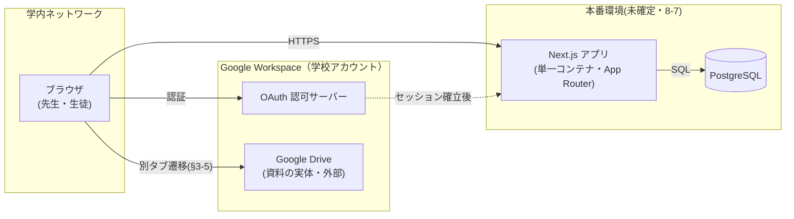
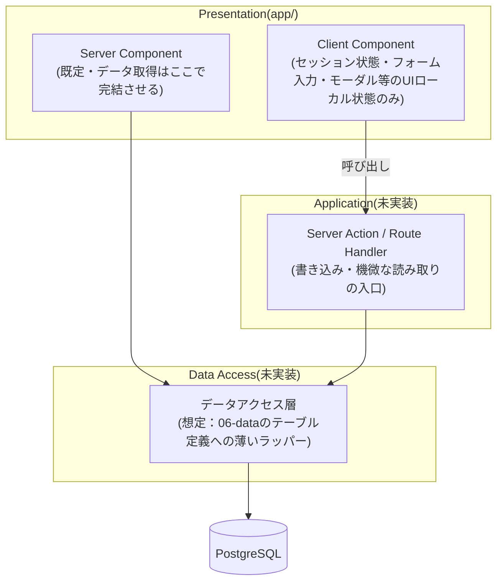

# 08. 方式設計

> **位置づけ**：どの技術で、どんな層構成で、どこに置いて動かすかを答える
> **確度**：**暫定（レビュー未了）**
> **正典**：このファイル（**技術スタックの一覧は `../../CLAUDE.md` §5**）
> **更新のしかた**：上書き
> **主担当**：蒲山
> **最終更新**：2026-09-04（蒲山）

## この章が答える問い

**要件を成立させる技術的な骨格は何か。** 機能設計（03）が「何をするか」なら、この章は「何の上で動くか」。

## 書かないもの

| 書かないこと | 参照先 |
| --- | --- |
| 技術スタックの一覧そのもの | `../../CLAUDE.md` §5（**再掲しない。採用理由だけ書く**） |
| 性能・可用性の目標値 | `09-nfr.md` |
| Google との IF | `07-interface.md` |

> **バッチ・スケジューラの節は置かない。** 設計原則「状態遷移は先生の明示操作を正とし、時刻・条件による自動遷移は持たない」（`../requirements.md` §3 冒頭）の帰結として、設計に存在しない。

---

## 8-1. 技術スタックと採用理由

| 層 | 採用 | バージョン方針 | 採用理由 | 出典 |
| --- | --- | --- | --- | --- |
| 言語 | TypeScript（strict） | Ph.2 で `package.json` 固定 | Next.js 標準構成。`strict` により実装時の型不整合を設計段階の意図から検出できる | `../../CLAUDE.md` §5 |
| フレームワーク | Next.js 16（App Router） | 同上 | 要件の中心は CRUD とメタデータ表示（実体レス・§1-1）で、Server Component 優先の App Router により API 層を薄く保てる | `../../CLAUDE.md` §5 |
| UI ライブラリ | React 19 ＋ React Compiler 有効 | 同上 | 手動メモ化（`useMemo`/`useCallback`）を書かずに再描画コストを抑制できる。`next.config.ts` の `reactCompiler: true` で有効化済み | `../../CLAUDE.md` §5 |
| スタイル | Tailwind CSS 4 | 同上 | ユーティリティクラスで完結し、画面数が多い割にデザインシステムを別途持つ規模ではない | `../../CLAUDE.md` §5 |
| DB | PostgreSQL 16（Docker イメージ `postgres:16-alpine`） | 同上 | `../../CLAUDE.md` §5 の確定採用。関係モデルで足りるデータ形状（§06-data.md） | `../../CLAUDE.md` §5・`docker-compose.yml` |
| DB アクセス | **`pg`（Node.js 標準ドライバ）を直接使用** ← 正典（Prisma）との乖離あり | 未確定 | 下記「ORM の採用方針」参照 | `src/app/api/health/db/route.ts` |
| 認証 | Auth.js ＋ Google Workspace OAuth（未実装・未検証） | 検証は設計フェーズ後半 | 学校 Google アカウントとの統合が前提。**OAuth が通るかが最大の技術リスク** | `../requirements.md` §5 |
| パッケージマネージャ | pnpm | — | `../../CLAUDE.md` 既定 | `../../CLAUDE.md` |
| 開発環境 | Docker（`node:24-alpine` ベース、`dev` ステージ） | — | ホストの Node バージョン差異を吸収。DB のみ Docker・アプリはホスト直起動も選択可（8-6） | `Dockerfile`・`docker-compose.yml` |

### ORM の採用方針 — 正典との乖離が未決着（新規：H-17）

`../../CLAUDE.md` §5 は ORM に **Prisma** を挙げているが、現状の実装（`src/app/api/health/db/route.ts` の DB 疎通確認）は `pg` の `Pool` を直接使っており、`package.json` に Prisma 系パッケージは無い。

- **現状の性質**：DB 疎通確認用の 1 エンドポイントのみで、業務データへのアクセス層はまだ存在しない（一覧・提出・コメント等はすべて `src/lib/mock/*` のインメモリデータ）。**まだ「実装が正典から逸脱した」と断定できる規模ではない**が、正典と実態が食い違ったまま次の実装（06 データ設計に基づくアクセス層）に入ると、どちらを正として書けばよいか判断できない
- **判断が要る点**：06 データ設計のテーブル定義をコードに落とす際、Prisma のスキーマ駆動（マイグレーション・型生成）を使うか、`pg` を直接使い続けるか
- **先行方針（Stage 1）**：`pg` 直接のまま実装を継続する。理由は次の2点
  1. 現時点のテーブル数・クエリの複雑さ（§06-data.md）は素朴な SQL で十分足りる規模で、ORM の抽象化コストに見合う複雑さがまだ無い
  2. `pg` は既に疎通確認で動作しており、切り替えは後からでも移行コストが局所的（アクセス層はまだ 1 箇所）
- **決着したときに変わる箇所**：本表の「DB アクセス」行、`../../CLAUDE.md` §5 の ORM 行、`06-data.md` のスキーマ定義の書式
- **未決 ID**：`../open-questions.md` **H-17**（本章執筆時に新規起票）

---

## 8-2. システム構成図

- **構成要素はブラウザ・Next.js アプリ・PostgreSQL の3つのみ。** メッセージキュー・キャッシュ層・バッチサーバーは置かない（設計原則の帰結）
- **Google Drive は資料の実体置き場であり、アプリからは直接アクセスしない**（Stage 1＝リンク登録・`../open-questions.md` #10）。ブラウザから別タブで直接遷移する（`../requirements.md` §3-5）
- **Google OAuth との接続は認証（ログイン）時のみ**発生し、以降のリクエストはアプリのセッションで完結する（Auth.js の標準パターン）

---

## 8-3. アプリケーション層構成

- **責務分界の原則**：一覧・詳細等の**読み取り**は Server Component が Data Access 層を直接呼ぶ。**書き込みと機微な読み取り**（ロール判定が要るもの）は必ず Server Action / Route Handler を経由させ、そこで権限判定を行う。画面側の表示制御は二次的な UX であって防御ではない（`../open-questions.md` **H-16** 先行方針をそのまま適用）
- **現状の実態との差分**：現時点の実装は Data Access 層・Server Action層とも未着手で、すべての画面が `src/lib/mock/*` のインメモリ配列を直接参照している。認可も `SessionContext`（`localStorage` の persona 切り替え）による**クライアント側の見た目の出し分けのみ**で、H-16 が指摘する状態そのもの。06 データ設計の骨格が引けた時点（K2）で、Data Access 層と Server Action の導入に着手する
- **Client Component の範囲は限定する**：セッション状態（`SessionContext`）、認証ガード（`AuthGuard`）、ロールに応じた表示切り替え（`RoleGate`）、フォームの入力状態、モーダル・確認ダイアログの開閉。**一覧・詳細のデータ取得を Client Component 側で行わない**（Server Component 優先の原則・8-4）

---

## 8-4. 状態管理とデータ取得の方針

- **原則**：Server Component を既定とし、取得したデータはページ単位で完結させる。グローバルなクライアント状態管理ライブラリ（Redux・Zustand 等）は導入しない — 要件の大半は「一覧を見る・フォームを送る」の単純な往復で、状態管理の複雑さに見合う UI 遷移が無い
- **Client Component が持ってよい状態**：認証セッション（`SessionContext`）、フォームの未送信入力、UI のローカルな開閉状態のみ。**サーバーから取得したデータのキャッシュや同期はクライアント側で持たない**
- **再検証（revalidate）のタイミング**：
  - 通常の一覧・詳細画面は、遷移・再読み込み時の Server Component 再実行で最新化する（Next.js の既定動作）
  - 当日タイムテーブルの進行状態のみ特別扱いが要る（8-5）

---

## 8-5. 当日進行の伝播方式

- **要件**：`../requirements.md` §3-10。先生が「発表中」を切り替えると、聴く生徒の画面へ反映する必要がある
- **先行方針（Stage 1）**：**手動リロード**。生徒側画面に更新ボタンを置くのみで、自動更新機構は持たない（`../open-questions.md` **#4** 先行方針）
- **決定後（M1 で決着予定）に変わる箇所**：同時アクセス 120 名が確定済み（`../requirements.md` §4 性能）で、判断基準（2026-07-24 言語化）を適用すればポーリングで即断できる状態にある。ポーリングに決した場合：
  - 生徒側のタイムテーブル画面が、一定間隔で当日進行状態のみを再取得する
  - **間隔の根拠は `09-nfr.md` の応答時間目標に従う**（`../open-questions.md` **G-3**・性能目標値が正典に無いため未確定。目標値が決まればポーリング間隔の上限はそこから逆算する）
  - SSE・WebSocket は「規模が問題かつ実装コストが妥当な場合」の選択肢だが、追加基盤（コネクション管理）が要り、120 名規模ではポーリングで足りる見込みが高い
- **未決 ID**：`../open-questions.md` **#4**（決定待ち＝M1）・**G-3**（間隔の根拠）

---

## 8-6. 開発・実行環境

### Docker 構成

- `Dockerfile`：`node:24-alpine` ベース。`deps` ステージで `pnpm install --frozen-lockfile`、`dev` ステージでソース一式をコピーし `pnpm dev` を実行
- `docker-compose.yml`：`db`（`postgres:16-alpine`）と `app`（`Dockerfile` の `dev` ターゲット）の2サービス。`app` は `db` の healthcheck 通過後に起動する
- **Turbopack の制約**：`next dev` の既定バンドラ（Turbopack）は、Windows の Docker Desktop 経由のバインドマウントだとホスト側のファイル変更を検知できないことがあるため、`app` サービスは `pnpm exec next dev --webpack` ＋ `WATCHPACK_POLLING=true` で起動する。ホストで直接 `pnpm dev` する場合は Turbopack のままでよい

### 環境変数

- `.env.example` をコピーして `.env` を作成（`POSTGRES_USER` / `POSTGRES_PASSWORD` / `POSTGRES_DB` / `DATABASE_URL`）
- ホストで直接 `pnpm dev` し DB だけ Docker を使う場合は、`.env.local` で `DATABASE_URL` のホスト名を `db` → `localhost` に変える（Next.js は `.env.local` を `.env` より優先して読む）

### ローカル起動手順（2通り）

| 手順 | 用途 |
| --- | --- |
| `cp .env.example .env` → `docker compose up --build` | アプリ・DB とも Docker（ホットリロードはバインドマウント経由） |
| `docker compose up -d db` → `.env.local` 作成 → `pnpm install` → `pnpm dev` | アプリはホスト直起動、DB のみ Docker（Turbopack を使える） |

- 疎通確認：`http://localhost:3000/api/health/db` が `{"status":"ok"}` を返せば DB 接続成功
- **既知の落とし穴**：Docker でアプリコンテナを起動した後にホストで直接 `pnpm dev` すると、`.next` が root 所有になり `EACCES` で失敗することがある。`rm -rf .next` してから再実行する

---

## 8-7. デプロイ構成

**保留。** 本番環境（インターネット経由／イントラネット）が未確定（`../requirements.md` §5・企画書 §2-2）。判断期限を学校側と合意する必要があり、水戸がステークホルダー対応として調整中（`../open-questions.md` §7・対面ヒヤリングでの回収項目）。

- 決まり次第、次を書く：ホスティング先・コンテナ実行環境・DB のマネージド or 自前運用・HTTPS 終端・ビルド〜デプロイの手順
- 依存する未決：本番環境の選定そのもの（設計原則上、時刻・条件による自動遷移を持たないため、デプロイ構成自体に自動化のスコープ差は生じない想定）

---

## 現在の状態

**書き切った。8-7（デプロイ構成）のみ、本番環境の未確定により保留。**

執筆にあたり新たに見つかった未決を1件、`../open-questions.md` に起票した（H-17：ORM が正典（Prisma）と実装（`pg` 直接）で乖離している）。あわせて `../findings.md` に F-01 として記録した。
