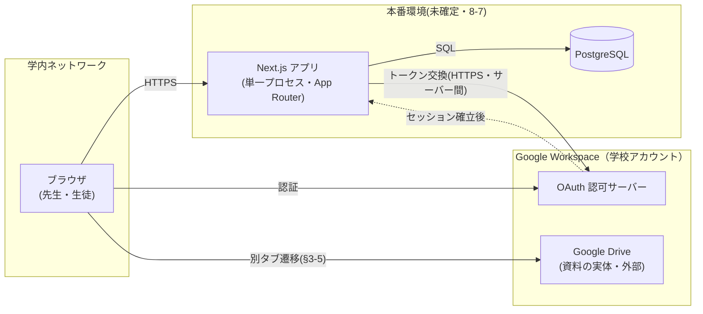
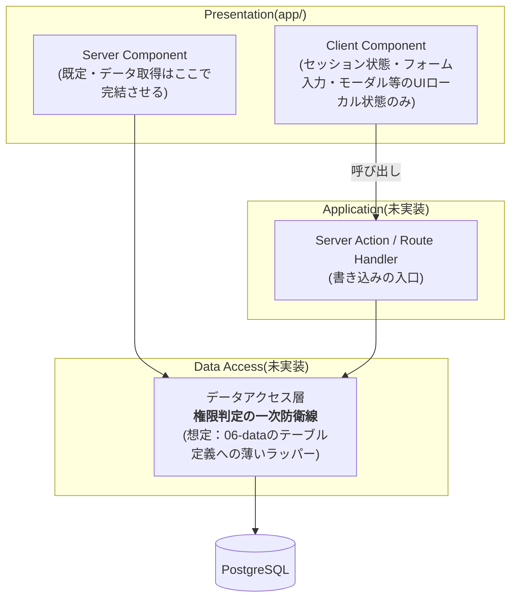

# 08. 方式設計

> **位置づけ**：どの技術で、どんな層構成で、どこに置いて動かすかを答える
> **確度**：**暫定（レビュー未了）**
> **正典**：このファイル（**技術スタックの一覧は `../../CLAUDE.md` §5**）
> **更新のしかた**：上書き
> **主担当**：蒲山
> **最終更新**：2026-10-08（蒲山）

## この章が答える問い

**要件を成立させる技術的な骨格は何か。** 機能設計（03）が「何をするか」なら、この章は「何の上で動くか」。

## 書かないもの

| 書かないこと | 参照先 |
| --- | --- |
| 技術スタックの一覧そのもの | `../../CLAUDE.md` §5（**再掲しない。採用理由だけ書く**） |
| 性能・可用性の目標値 | `09-nfr.md` |
| Google との IF | `07-interface.md` |

> **バッチ・スケジューラの節は置かない。** 設計原則「状態遷移は先生の明示操作を正とし、時刻・条件による自動遷移は持たない」（`../requirements.md` §3 冒頭）の帰結として、設計に存在しない。

---

## 8-1. 技術スタックと採用理由

| 層 | 採用 | バージョン方針 | 採用理由 | 出典 |
| --- | --- | --- | --- | --- |
| 言語 | TypeScript（strict） | Ph.2 で `package.json` 固定 | Next.js 標準構成。`strict` により実装時の型不整合を設計段階の意図から検出できる | `tsconfig.json`（`../../CLAUDE.md` §5 はフレームワークとしての TypeScript 採用のみを定め、`strict` 化は実装側の判断） |
| フレームワーク | Next.js 16（App Router） | 同上 | 要件の中心は CRUD とメタデータ表示（実体レス・§1-1）で、Server Component 優先の App Router により API 層を薄く保てる | `package.json`（`../../CLAUDE.md` §5 は Next.js 採用のみを定め、具体バージョンは「Ph.2 で固定」としか言っていない） |
| UI ライブラリ | React 19 ＋ React Compiler 有効 | 同上 | 手動メモ化（`useMemo`/`useCallback`）を書かずに再描画コストを抑制できる。`next.config.ts` の `reactCompiler: true` で有効化済み | `package.json`・`next.config.ts`・**`../../CLAUDE.md` §5**（**企画書 §2-3 には記載が無く、2026-09-06 に `../decisions.md` を出典として §5 へ正典化した — H-18 決着**） |
| スタイル | Tailwind CSS 4 | 同上 | ユーティリティクラスで完結し、画面数が多い割にデザインシステムを別途持つ規模ではない | `package.json`・**`../../CLAUDE.md` §5**（**企画書 §2-3 には記載が無く、2026-09-06 に `../decisions.md` を出典として §5 へ正典化した — H-18 決着**） |
| DB | PostgreSQL 16（Docker イメージ `postgres:16-alpine`） | 同上 | `../../CLAUDE.md` §5 の確定採用。関係モデルで足りるデータ形状（テーブル定義は `06-data.md` 6-3） | `../../CLAUDE.md` §5・`docker-compose.yml` |
| DB アクセス | **Prisma**（2026-09-05 に採用決定。**モデルと初回マイグレーションを導入**〔06 データ設計 #23 の 6-3 から導出〕。業務データのアクセス層（8-3 の Data Access）は未実装） | バージョン番号は `package.json` が正 | `../../CLAUDE.md` §5・企画書 §2-3 の正典どおり。driver adapter（`@prisma/adapter-pg`）は `../decisions.md`（2026-09-29）で決着。疎通確認の `pg` 直接使用は暫定で、業務データのアクセス層には持ち込まない。下記「ORM の採用方針」参照 | `../decisions.md`（2026-09-05・2026-09-29）・`prisma/schema.prisma`・`src/lib/prisma.ts`・`src/app/api/health/db/route.ts`（疎通確認は現状のまま `pg` 直接） |
| PDF 生成 | 純粋 JS の PDF ライブラリ（ヘッドレスブラウザ非依存） | 銘柄は実装着手時に確定 | Chromium 同梱を避ける（K3 検証・`../decisions.md` 2026-09-04） | `../decisions.md`・`05-output.md` 5-4 |
| 認証 | Auth.js ＋ Google Workspace OAuth（サインインの疎通は一次検証済み・ロール解決は未実装） | 本番投入可否は未検証（`07-interface.md` 7-2） | 学校 Google アカウントとの統合が前提。**OAuth が通るかが最大の技術リスク**（一次検証は通った・`../findings.md` F-04） | `../requirements.md` §5・`07-interface.md` 7-2 |
| パッケージマネージャ | pnpm | — | `../../CLAUDE.md` 既定 | `../../CLAUDE.md` |
| バンドラ | **Turbopack（固定）** | — | dev と build で別のバンドラを通る状態を作らない。既定に頼らず `--turbopack` を明示する（8-6・`../findings.md` **F-02**） | `package.json` |
| 開発環境 | **Docker は PostgreSQL のみ**／Next.js アプリはホスト直起動 | — | アプリをコンテナに入れたことだけが原因の問題（バインドマウント越しのファイル監視・`.next` の所有者・バンドラの使い分け）を設計から消す（8-6・`../findings.md` **F-02**） | `docker-compose.yml` |

### ORM の採用方針 — 2026-09-05 に Prisma 採用で決着（旧 監査 M-1 → H-17）

**決定：DB アクセスの ORM は Prisma を採用する**（`../decisions.md` 2026-09-05・未決 H-17 の決着）。06 データ設計のテーブル定義は Prisma のスキーマ駆動（マイグレーション・型生成）で実装へ落とす。**`pg` の直接使用は DB 疎通確認エンドポイント（`src/app/api/health/db/route.ts`）に限った暫定であり、業務データのアクセス層には持ち込まない。**

**これは正典どおりに戻す決定であって、正典の変更ではない。** `CLAUDE.md` §5 の Prisma は独自の技術選定ではなく、**企画書 §2-3「ソフトウェア構成」に明記された凍結済み Ph.0 成果物**（先生に説明済み）が出どころで、逸脱するなら対外的な説明責任が発生する。

- **乖離の経緯**：`main` の実装が `pg` 直接で始まっていた乖離は 2026-09-03 の三者整合性監査で M-1 として見つかっていたが `open-questions.md` への起票が漏れており、本章の執筆時に実物を再確認して H-17 として正式に昇格させた（`../findings.md` F-01）。**起票から決着まで 1 日。**
- **決定時点（2026-09-05）の性質**：当時の `main` の `src/` は DB 疎通確認用の 1 エンドポイントのみで、業務データへのアクセス層は無かった（`src/lib/mock/*` 等のモックデータは鈴木さんの `feature/mock` 側にあった。いまの `src/` は 8-3 の「現状の実態との差分」）。**切り替えコストが最小の時点で決めた**
- **スケジュール**：現行スケジュールの **W13（9/11〜9/17）が「DB接続・Prisma セットアップ・マイグレーション」を前提に組まれている**。本決定は期限 9/11 に対して先行している
- **明示しておく留保**：**W9 に予定されていた Prisma の技術検証は未実施**で、本決定は**未検証のまま正典に従う**判断である。検証で不成立が判明した場合は `../decisions.md` へ【変更】として追記する
- **この決定が効く先**：本表の「DB アクセス」行（反映済み）・`06-data.md` 6-7（Prisma への落とし込み・反映済み）。`../../CLAUDE.md` §5 の ORM 行は**元から Prisma なので変更不要**

---

## 8-2. システム構成図


```mermaid
flowchart LR
    subgraph 学内ネットワーク
        Browser["ブラウザ<br/>(先生・生徒)"]
    end

    subgraph "本番環境(未確定・8-7)"
        App["Next.js アプリ<br/>(単一プロセス・App Router)"]
        DB[("PostgreSQL")]
    end

    subgraph Google["Google Workspace（学校アカウント）"]
        OAuth["OAuth 認可サーバー"]
        Drive["Google Drive<br/>(資料の実体・外部)"]
    end

    Browser -- "HTTPS" --> App
    App -- "SQL" --> DB
    Browser -- "認証" --> OAuth
    App -- "トークン交換(HTTPS・サーバー間)" --> OAuth
    OAuth -. "セッション確立後" .-> App
    Browser -- "別タブ遷移(§3-5)" --> Drive
```

- **構成要素はブラウザ・Next.js アプリ・PostgreSQL の3つのみ。** メッセージキュー・キャッシュ層・バッチサーバーは置かない（設計原則の帰結）
- **Google Drive は資料の実体置き場であり、アプリからは直接アクセスしない**（Stage 1＝リンク登録・`../open-questions.md` #10）。ブラウザから別タブで直接遷移する（`../requirements.md` §3-5）
- **Google OAuth との接続は認証（ログイン）時のみ**発生し、以降のリクエストはアプリのセッションで完結する（Auth.js の標準パターン）。**ただしログイン時には、ブラウザ経由の認可に加えて、アプリのサーバーから Google のトークンエンドポイントへの外向きの通信（トークン交換）が要る**（`../findings.md` F-04）。**本番環境がイントラネットの場合、このエッジが成立するかが `../open-questions.md` H-23 の論点**

---

## 8-3. アプリケーション層構成


```mermaid
flowchart TB
    subgraph "Presentation(app/)"
        SC["Server Component<br/>(既定・データ取得はここで完結させる)"]
        CC["Client Component<br/>(セッション状態・フォーム入力・モーダル等のUIローカル状態のみ)"]
    end
    subgraph "Application(未実装)"
        SA["Server Action / Route Handler<br/>(書き込みの入口)"]
    end
    subgraph "Data Access(未実装)"
        Repo["データアクセス層<br/><b>権限判定の一次防衛線</b><br/>(想定：06-dataのテーブル定義への薄いラッパー)"]
    end
    DB[("PostgreSQL")]

    SC --> Repo
    CC -- "呼び出し" --> SA
    SA --> Repo
    Repo --> DB
```

- **責務分界の原則**：一覧・詳細等の**読み取り**は Server Component がデータアクセス層を直接呼ぶ。**書き込み**は Server Action / Route Handler を経由させる。**経路は 2 本あるが、権限判定は 1 か所でしか行わない**（下記）
- **権限判定の一次防衛線はデータアクセス層に置く**（2026-09-06・H-16 決着・`../decisions.md`／`../requirements.md` §4 セキュリティ）。**読み取りか書き込みかを問わず、データアクセス層を通る際に必ずロールと文脈（その発表が自チームか否か）を判定する。** **Server Action / Route Handler の入口に重複した権限判定は置かない**（2026-09-06 の設計判断・`09-nfr.md` 9-4）。「置いてよい」という許可の形にすると、**実装者ごとに判断が割れる余地が 2 枚目の側に残る** — H-16 が一次防衛線について消したものと同じ余地である。画面側の表示制御は二次的な UX であって防御ではない
  > **旧・先行方針（「書き込みと機微な読み取り」だけ Server Action 経由で判定）は採らない。** 8-3 の構成では**読み取りが Server Action を通らない**ため、公開前の資料（`../requirements.md` §3-3）・公開許可のない作品（同 §3-7）という**認可の主戦場である一覧画面が防衛線の外に出る**。かといって「機微な読み取り」を広く取ると 8-4 の Server Component 優先が崩れる。**データアクセス層へ移すとこの二択自体が消えるため、「機微な読み取り」という区別は設計から削除した。**
  > **文脈（自チームか否か）の判定の実装は 06 データ設計に依存する**（所属関係の照会が要る）。層の決定は 06 と独立だが、判定の具体は 06 の後
- **現状の実態との差分**：`main` の `src/` は DB 疎通確認（`app/api/health/db/route.ts`）・認証（`auth.ts`／`app/api/auth/[...nextauth]/route.ts`。サインインの一次検証まで）・Prisma クライアント（`lib/prisma.ts`）と `app/` の雛形の4ファイル（`layout.tsx`／`page.tsx`／`globals.css`／`favicon.ico`）のみで、Data Access 層・Server Action 層は存在しない。**`src/lib/mock/*`・`SessionContext`・`AuthGuard`・`RoleGate` は、鈴木さんの `feature/mock`（未マージ）に実装されているモックであり、`main` にはまだ無い。** 統合後の実態としては、すべての画面が `src/lib/mock/*` のインメモリ配列を直接参照し、認可も `SessionContext`（`localStorage` の persona 切り替え）による**クライアント側の見た目の出し分けのみ**という、**H-16 が指摘していた状態そのもの**になる見込み（**2026-09-06 に決着したので、統合時にデータアクセス層での判定へ寄せる**）。06 データ設計の骨格が引けた時点（K2）で、Data Access 層と Server Action の導入に着手する
- **Client Component の範囲は限定する**：セッション状態、認証ガード、ロールに応じた表示切り替え、フォームの入力状態、モーダル・確認ダイアログの開閉。**一覧・詳細のデータ取得を Client Component 側で行わない**（Server Component 優先の原則・8-4）。`feature/mock`（未マージ）はこの範囲を `SessionContext`／`AuthGuard`／`RoleGate` として実装しており、統合後の実装もこの3コンポーネントの役割分担を踏襲する想定

---

## 8-4. 状態管理とデータ取得の方針

- **原則**：Server Component を既定とし、取得したデータはページ単位で完結させる。グローバルなクライアント状態管理ライブラリ（Redux・Zustand 等）は導入しない — 要件の大半は「一覧を見る・フォームを送る」の単純な往復で、状態管理の複雑さに見合う UI 遷移が無い
- **Client Component が持ってよい状態**：認証セッション（`feature/mock`（未マージ）実装では `SessionContext`）、フォームの未送信入力、UI のローカルな開閉状態のみ。**サーバーから取得したデータのキャッシュや同期はクライアント側で持たない**
- **再検証（revalidate）のタイミング**：
  - 通常の一覧・詳細画面は、遷移・再読み込み時の Server Component 再実行で最新化する（Next.js の既定動作）
  - 当日タイムテーブルの進行状態のみ特別扱いが要る（8-5）

---

## 8-5. 当日進行の伝播方式

- **要件**：`../requirements.md` §3-10。先生が「発表中」を切り替えると、聴く生徒の画面へ反映する必要がある
- **確定（2026-09-04・#4 決着）**：**ポーリング**。生徒側のタイムテーブル画面が、一定間隔で当日進行状態のみを再取得する（`../decisions.md` 同日）
  - **根拠①（規模）**：伝播対象は「発表中の発表」と「発表順・時刻枠」だけで、同時 120 名でも要求レートは十数 req/s のオーダー。判断基準（2026-07-24 言語化）の第 1 分岐「規模が問題にならない」に落ちる
  - **根拠②（本番環境）**：**本番環境が未確定**（`../requirements.md` §5）である以上、接続を張り続ける SSE・WebSocket は**ホスティング形態に賭けることになる**。WebSocket は App Router 単体では張れず別プロセス（コネクション管理）が要り、Docker 構成と 8-7 が変わる。ポーリングは通常の HTTP リクエストなので、どの形態でも成立する（`../../CLAUDE.md` 禁則5）
- **未確定：ポーリング間隔の値。** 根拠になるのは**許容遅延**（生徒が自分の出番に気づける遅れの上限）で、これが正典に無い。発表 1 コマの所要時間から導ける → `../open-questions.md` §6 保留
  - **応答時間目標（`../requirements.md` §4 性能・2026-09-05 確定）とは別の指標。** 応答時間は「1 リクエストが返る速さ」、間隔は「データが最大どれだけ古くてよいか」。9-1 で混ぜない
- **実装の先行方針**：暫定間隔で組む。**間隔を 1 箇所の定数に置き**、決定後に差し替えられる形にする
- **未決 ID**：`../open-questions.md` **§6 保留**（間隔の値）

---

## 8-6. 開発・実行環境

**Docker で管理するのは PostgreSQL のみ。Next.js アプリはホストで直接起動する**（2026-09-04 決定・`../decisions.md`）。

### Docker 構成

- `docker-compose.yml`：`db`（`postgres:16-alpine`）の **1 サービスのみ**。データは名前付きボリューム `db_data` に永続化し、`pg_isready` で healthcheck する
- **アプリ用のコンテナと `Dockerfile` は持たない。** バインドマウント越しのファイル監視・`.next` の所有者問題・バンドラの使い分けといった、**アプリをコンテナに入れたことだけが原因の問題**を設計から消すため（`../findings.md` **F-02**）
- 企画書 §3-1 の「Docker＝チーム内で開発環境を統一する道具」は、**揃える必要があるのは DB のバージョンとデータ**であるため、DB のみの管理で満たされる
- **Node のバージョンは `.nvmrc`（`24`）で固定する。** アプリをコンテナから出したことで Docker による Node の固定が外れるため、その代替。CI も `.nvmrc` を読む
- **pnpm のバージョンは `package.json` の `packageManager`（`pnpm@11.17.0`）で固定する。** 旧 `Dockerfile` の `corepack enable` が担っていた役割の明示化。corepack と CI の双方がこの値を読む

### バンドラ

- **Turbopack に固定する。** `package.json` の `dev` / `build` に `--turbopack` を明示する
- 既定値に頼らず明示するのは、**dev と build で別のバンドラを通る状態を作らない**ため。Next.js 16 はどちらも Turbopack が既定だが、既定は将来変わりうる（`../findings.md` **F-02**）

### 環境変数

- `.env.example` をコピーして `.env` を作成（`POSTGRES_USER` / `POSTGRES_PASSWORD` / `POSTGRES_DB` / `DATABASE_URL` / `AUTH_SECRET` / `AUTH_GOOGLE_ID` / `AUTH_GOOGLE_SECRET` / `SCHOOL_WORKSPACE_DOMAIN`）
- **`DATABASE_URL` のホスト名は `localhost`。** アプリはホストから起動し、`db` サービスが公開する 5432 番へ繋ぐ。**`.env.local` による上書きは不要**（手順が 1 つになったため）
- **`AUTH_SECRET` / `AUTH_GOOGLE_ID` / `AUTH_GOOGLE_SECRET` / `SCHOOL_WORKSPACE_DOMAIN` は `.env.example` では空。** 下の疎通確認（`/api/health/db`）までは空のままで動く。`SCHOOL_WORKSPACE_DOMAIN` が空だと `src/auth.ts` が読み込み時に例外を投げるため、`pnpm build` の前にはこれを、サインインを試す前には 4 つとも値を入れる（作り方は `.env.example` のコメント）

### Docker の用意

**Docker Desktop でも、WSL（Ubuntu）内に直接入れた Docker Engine でも、上の `docker-compose.yml` は同じに動く。** 設計が求めるのは `docker compose` が使えることだけで、どちらを使うかは縛らない（決定ではなく、動作確認の結果）。**混ぜないこと** — 両方が有効だと `docker` の向き先が分かりにくくなる。

**Docker Desktop が入っている場合は、先に Desktop の Settings > Resources > WSL Integration でこのディストリビューションを OFF にしてから入れる**（両方が有効だと競合しうる。https://docs.docker.com/desktop/features/wsl/ ）。Engine を入れたあとに OFF にした場合は、直後に `/run/docker.sock` が消えて `docker` が繋がらなくなることがある。Engine は壊れていないので `sudo systemctl restart docker.socket docker.service` で戻る（`db` は `restart: unless-stopped` で自動復帰する）。**先に OFF にすれば当たりにくい、というのは推測で、実機では試していない**

Docker Desktop なしで入れる手順（Ubuntu。2026-10-08 に Ubuntu 26.04 で確認。24.04 も同じ手順 — コードネームは `os-release` から自動で入る）：

```bash
sudo apt-get update && sudo apt-get install -y ca-certificates curl
sudo install -m 0755 -d /etc/apt/keyrings
sudo curl -fsSL https://download.docker.com/linux/ubuntu/gpg -o /etc/apt/keyrings/docker.asc
sudo chmod a+r /etc/apt/keyrings/docker.asc
echo "deb [arch=$(dpkg --print-architecture) signed-by=/etc/apt/keyrings/docker.asc] https://download.docker.com/linux/ubuntu $(. /etc/os-release && echo $VERSION_CODENAME) stable" | sudo tee /etc/apt/sources.list.d/docker.list >/dev/null
sudo apt-get update
sudo apt-get install -y docker-ce docker-ce-cli containerd.io docker-buildx-plugin docker-compose-plugin
sudo usermod -aG docker $USER && sudo systemctl enable --now docker
```

- 前提は systemd が動いていること（`ps -p 1 -o comm=` が `systemd`）。動いていなければ `/etc/wsl.conf` の `[boot]` 節に `systemd=true` を書き、PowerShell で `wsl --shutdown` してから開き直す（WSL 本体が古いときは先に `wsl --update`）。`docker` グループの追加も、**`wsl --shutdown` で WSL を開き直すまで反映されない**
- 確認：`readlink -f "$(command -v docker)"` が `/usr/bin/docker`（`/mnt/wsl/docker-desktop/...` なら Desktop の CLI）、`docker info --format '{{.OperatingSystem}}'` が `Ubuntu ...`（`Docker Desktop` なら Desktop の Engine）であること。`which -a docker` に出る `/bin/docker`（`/usr/bin` と同じもの）と `/mnt/c/Program Files/Docker/...`（Windows 側の Desktop の入口）は無視してよい。**Engine 側の出力（`/usr/bin/docker`・`Ubuntu 26.04 LTS`・`systemd`）は 2026-10-08 に実機で確かめた。Desktop 側の表示（`/mnt/wsl/docker-desktop/...`・`Docker Desktop`）は、公式の文書でも実機でも確かめていない**
- Docker Desktop 側のイメージ・ボリューム（DB のデータ）は WSL 内の Engine へ引き継がれない。開発用 DB は `prisma migrate deploy` で作り直せるが、中身が要る場合は移行前に確認する
- ターミナルを閉じても Docker は止まらない（systemd が管理するため）。止まるのは `wsl --shutdown` や Windows の再起動で WSL ごと終了したとき。`enabled` のままなら、次の WSL 起動で Docker も `db` も戻る。Docker 自体を止めるなら `sudo systemctl stop docker.service docker.socket`（**`docker.socket` も止める** — 残すと `docker` コマンドで自動復活する）

### ローカル起動手順

```bash
cp .env.example .env
docker compose up -d db
pnpm install
pnpm exec prisma migrate deploy
pnpm dev
```

- 疎通確認：`http://localhost:3000/api/health/db` が `{"status":"ok"}` を返せば DB 接続成功
- 停止は `docker compose down`。データは `db_data` に残る。データごと消すなら `docker compose down -v`
- `pnpm install` の `postinstall` で `prisma generate` が走る（初回 clone・lockfile 更新時）。**`schema.prisma` の変更だけを pull したとき（`node_modules` は変わらない）は `postinstall` が走らないため、`pnpm exec prisma generate` を手で実行すること**。**pull でマイグレーション（`prisma/migrations/`）が増えたときは、`pnpm exec prisma migrate deploy` で手元の DB に適用すること**
- `pnpm exec prisma migrate deploy` は既存のマイグレーション（`prisma/migrations/`）をそのまま適用する。**新しいマイグレーションを作る（`migrate dev`）ときは、DEFERRABLE な一意制約（`presentations`）を `DROP INDEX` しようとして失敗しないか確認すること**（`docs/design/06-data.md` 6-7・`prisma/schema.prisma` の `Presentation` モデルのコメント参照）

### 既存環境からの移行（2026-09-04 の変更に伴い 1 回だけ必要）

**アプリを Docker で動かしていた期間があるため、旧構成の残骸が 3 つ残る。** いずれも実機で確認済み。

| 残骸 | 症状 | 対処 |
| --- | --- | --- |
| 旧 `app` コンテナ | compose から消えても**コンテナは残り、3000 番を掴み続ける**。ホストで `pnpm dev` すると 3001 番へ退避し、ブラウザは古いコンテナを見る | `docker compose up -d db --remove-orphans` |
| 既存の `.env` | `DATABASE_URL` が `@db:5432` のままで、`localhost` から繋がらない（`cp -n` では上書きされない） | `cp .env.example .env` で作り直す |
| `.next` の所有者 | 旧 `app` コンテナが root で書いたファイルが残り、`rm -rf .next` が `Permission denied` で失敗する | `sudo rm -rf .next`（または別名へ退避） |

> **3 つとも「アプリをコンテナに入れていたこと」だけが原因**で、移行後は二度と起きない。これが本決定の実利。

---

## 8-7. デプロイ構成

> **この節は下書き（2026-10-03）。** 8-7-1〜8-7-4 は書ける範囲を書いた。8-7-5 は未執筆で、`../findings.md` F-04・F-07・F-11 を引いて書く。8-7-1 の先行方針は、`../decisions.md` 2026-10-02 の本番環境の行（段階を踏む）に合わせた。8-7-2 以降は、それより前の先行方針（インターネット経由を既定）のもとで書いた。

### 8-7-1. 前提と先行方針（`00-conventions.md` §3-3 の 3 点）

- **前提とした先行方針**：`../open-questions.md` §7 の表の「H-23・H-28 段階①（学内で動かす）の成立条件」の行（段階①〔学内のネットワーク〕を既定として書く）。本番環境は段階を踏む（①まず学内 → ②完成度を見てインターネット経由・`../decisions.md` 2026-10-02）。①の置き場所・名前・証明書は `../requirements.md` §5 のとおり未決。8-5 のポーリングは変えない
- **決着したときに変わる箇所**：
  - ①の置き場所が決まる（H-28 (c)）→ 8-7-2 の実行形態、8-7-4 の HTTPS 終端と redirect URI の置き場所、8-7-5
  - ホスティング先・請求先が決まる（G-1・G-6）→ 8-7-2 の候補の絞り込み、8-7-6
  - 本番 DB の置き場所が決まる → 8-7-3 のマイグレーションの適用場所
  - G-6 が「学外には置けない」で決着する → ②の移り先を見直す（学校の AWS が G-6 に当たるかは、②へ移る前に確かめる・`../open-questions.md` G-6）。①ではデータが学内に留まるので、①の既定には効かない
- **未決 ID**：**H-23・H-28**（段階①の成立条件）・**G-1**（運用・費用の主体）・**G-6**（学外へのデータ配置）・**G-2**（可用性。8-7-3 のリリース手順で停止時間を許すか）

### 8-7-2. 実行形態

- **構成要素は 8-2 のまま**（ブラウザ・Next.js アプリ・PostgreSQL。Google は外部）。キュー・キャッシュ・バッチは置かない。当日進行の伝播はポーリング（8-5）で、接続を張り続けないため、**HTTP リクエストを受けられる環境なら、方式の面ではホスティング形態を選ばない**（ただし、120 名のポーリングがプランの呼び出し回数・転送量の上限に収まるかは `../findings.md` F-09 で未確認）
- **自前で起動する形（コンテナ・VM・学内サーバー）では、アプリは `next start` で動く 1 プロセス。** `package.json` の `start` は `next start`。`next.config.ts` に `output` の指定は無い（standalone 出力は使っていない）
- **DB はマネージド PostgreSQL か、アプリと同じ環境の自前運用かのどちらか。** 接続は `DATABASE_URL` の 1 本だけで、アプリ側は `@prisma/adapter-pg`（`src/lib/prisma.ts`）で繋ぐ。接続の張り方（サーバーレス実行かコンテナ実行か）による差が出るかは、`../findings.md` F-09 で未確認のまま
- **ホスティング先の銘柄はここでは決めない。** 候補間に技術的な差は見当たらなかった（F-09・机上調査・2026-09-24）。決まらない理由は技術ではなく、費用の支払い主体と学外へのデータ配置（G-1・G-6）が正典に無いこと
- **コンテナ化の要否は、選んだホスティング先に依存する。** **リポジトリに `Dockerfile` は無い**（8-6・F-02）。本番にコンテナを使う場合、`Dockerfile` はこの時点で新規に作るものになる。コンテナを使わない形（ビルド〜起動をホスティング側が行う形）なら不要

### 8-7-3. ビルドとデプロイの手順

**実装から読み取れる制約**（`package.json`・`prisma7.config.ts`・`src/auth.ts`）。

| 制約 | 根拠 | 帰結 |
| --- | --- | --- |
| install の時点で `scripts/only-pnpm.mjs` が見える必要がある | `package.json` の `preinstall` が `node scripts/only-pnpm.mjs` を実行し、npm・yarn・bun での install を止める | **ビルド環境のパッケージマネージャは pnpm に固定する**（ホスティング側の既定が npm なら切り替える）。依存だけを先に install するコンテナの層分けでは、`scripts/` も先にコピーする |
| ビルドに devDependencies が要る | `prisma`・`dotenv`・`typescript`・`tailwindcss`・`babel-plugin-react-compiler` はすべて devDependencies | **ビルド段階の install は `--prod` にしない**（`pnpm install --frozen-lockfile`）。`--prod` では `postinstall` の `prisma generate` が `prisma` 不在で失敗する |
| Prisma クライアントは生成物でリポジトリに無い | `src/generated/prisma` は `.gitignore` 対象。`postinstall` が `prisma generate` を実行 | **`next build` の前に `prisma generate` が済んでいること**が要る。install の `postinstall` に任せるなら、`schema.prisma` と `prisma7.config.ts` が install の時点で見える状態にする（スキーマより先に依存だけを install する形は失敗する） |
| マイグレーションの適用に Prisma CLI が要る | `pnpm exec prisma migrate deploy`（8-6）。CLI は `prisma7.config.ts` を読み、`dotenv` を import する | **適用を行う環境には `prisma` と `dotenv` が必要。** 実行時の環境（`next start` だけを動かす環境）に入れないなら、適用はビルド側・リリース段階の別ジョブで行う。**適用を行う環境は、本番 DB へ到達でき、本番の `DATABASE_URL` を持つこと**（`prisma7.config.ts` が `DATABASE_URL` から読む） |
| ビルド時に `SCHOOL_WORKSPACE_DOMAIN` が要る | `src/auth.ts` が読み込み時に未設定なら例外を投げる（8-6）。**2026-10-04 に `next build --webpack` で確かめた**：未設定だと `/api/auth/[...nextauth]` のページデータ収集で失敗し、設定すると通る（本番の `pnpm build` は `--turbopack` で、こちらでは未実行） | **ビルド環境にも `SCHOOL_WORKSPACE_DOMAIN` を渡す。** 値を空のままだとビルドが落ちる |

**手順の順序**（1 リリースあたり。自前で起動する形の場合。ビルドと起動をホスティング側が行う形では、手順 3 の置き場所はホスティング先が決まってから書く）：

1. 依存を入れる（`pnpm install --frozen-lockfile`。`postinstall` で `prisma generate`）
2. ビルドする（`pnpm build`）
3. マイグレーションを適用する（`pnpm exec prisma migrate deploy`）。**1 プロセス構成なので、旧アプリを止めてから適用し、新アプリを起動する**（停止時間を許す形。許すかどうかは G-2 が正典に無く未決）。止めずに入れ替えるなら、マイグレーションを旧アプリと両立する形（列・表の追加のみ）に限る
4. アプリを起動する（`pnpm start`）

**本番で渡す環境変数**（`.env.example` から、ローカル開発専用のものを除く）：`DATABASE_URL`・`AUTH_SECRET`・`AUTH_GOOGLE_ID`・`AUTH_GOOGLE_SECRET`・`SCHOOL_WORKSPACE_DOMAIN`。加えて、`AUTH_URL`（公開 URL）か `AUTH_TRUST_HOST=true` のどちらかが要る見込み（`.env.example` には無い。`@auth/core` 0.41.3 の `lib/utils/env.js` は `trustHost` の既定を、`AUTH_URL`・`AUTH_TRUST_HOST`・Vercel・Cloudflare Pages のいずれかが無く `NODE_ENV` が `production` だと false にし、`lib/utils/assert.js` が `UntrustedHost` を返す。ソースを読んだだけで実機では確かめていない）。`POSTGRES_USER`／`POSTGRES_PASSWORD`／`POSTGRES_DB` は `docker-compose.yml` 用で、本番のアプリは使わない。**値の置き場所と渡し方は、ホスティング先と請求先（G-1）が決まるまで決まらない。** 秘密の値（`AUTH_SECRET`・`AUTH_GOOGLE_SECRET`・`DATABASE_URL` のパスワード）はリポジトリに置かない。

**未確認（実装時に確かめる）**：上の `AUTH_URL` と `AUTH_TRUST_HOST` のどちらを使うか、プロキシや PaaS の背後で redirect URI が一致するか。`src/auth.ts` と `.env.example` には `AUTH_URL`・`trustHost` の指定が無い。ホスティング先が決まったら、サインインの往復（redirect URI の一致）を実際に通して確かめる。

### 8-7-4. HTTPS と認証の接続

- **redirect URI は、公開ドメイン名・HTTPS で登録する前提で書く。** Google は Web アプリ用の redirect URI に HTTPS を求め、`http://localhost` だけが例外とされる（`../findings.md` F-04・F-11）。F-11 の入力欄の検証では、生のプライベート IP と `.local` の内部専用ホスト名は拒否され、学校ドメイン配下の公開ドメイン名は通った。**置き場所がどこでも、本番の redirect URI は生の IP や `.local` では登録できない。**
- **確かめたのは入力欄の検証までで、保存時と実際のサインイン時は未確認。** 本番のサインインが通ることは、ホスティング先が決まったあとに実機で確かめる（8-7-3 の「未確認」と同じ確認）
- **HTTPS の終端はアプリの外で行う前提で書く。** `next start` のままで、リポジトリ（`next.config.ts`・`package.json`）に TLS・証明書の設定は無い。終端を誰が担うか（ホスティング側かプロキシか）は、置き場所（8-7-2）が決まるまで決まらない
- **証明書の取り方と、学校ドメインの下の名前を誰がどこで向けるかは、学校側の確認が要る。** 残りの論点は F-11 の決着欄にある（水戸のヒヤリング領域。窓口は H-28 (c) と共通）

### 8-7-5. イントラネット案の位置づけ — 未執筆

- 書く内容：(a)・(b)・(d) の実施結果と、未了の (c)（置き場所と担当者）・学校側の DNS と証明書の確認を分けた表。採る場合に変わる箇所
- 引く先：`../findings.md` F-04（(a)）・F-07（(b)）・F-11（(d)）

### 8-7-6. 決着待ちの項目

- **ホスティング先・請求先**：G-1（費用の支払い主体・アカウントの名義）と G-6（学外へのデータ配置）の決着まで決まらない
- **PDF 生成の測り直し**：`05-output.md` 5-4 は、8-7 の決着時に、本番イメージに Chromium を載せるコストと、ホスト直起動で Chromium 実行環境を各開発者に用意するコストを測り直す、としている（要約。05 は確度「暫定」）。**現在の PDF 方式は純粋 JS 生成（ヘッドレスブラウザ非依存）で、8-7 の実行形態に Chromium を要求しない**（`../decisions.md` 2026-09-04）

---

## 現在の状態

**書き切った。8-7（デプロイ構成）のみ、8-7-1〜8-7-4 を下書き済み。8-7-5 は未執筆、ホスティング先と請求先は G-1・G-6 待ち。**

執筆・レビューにあたり `../open-questions.md` を2件更新した。

- **H-17**：ORM が正典（Prisma）と実装（`pg` 直接）で乖離している。2026-09-03 の三者整合性監査で M-1 として既出だったが起票が漏れていたものを、本章の執筆時に正式に昇格させた（`../findings.md` F-01）。→ **2026-09-05 に Prisma 採用で決着**（`../decisions.md`）。8-1 に反映済み
- **H-18**（新規）：UI 層の追加採用（Tailwind CSS 4・React Compiler）が `../../CLAUDE.md` §5・企画書 §2-3 いずれにも記載が無いまま実装されている（レビュー指摘を受けて起票）。→ **2026-09-06 に「§5 へ追記して正典化する」で決着**（`../decisions.md`）。**§5 には出典列が新設され、企画書由来か本ログ由来かが行ごとに読める**。8-1 に反映済み

8-3・8-6 の「現状の実装」の記述は、`main` の実態（`feature/mock` は未マージ）に合わせてある。

**2026-09-04：開発環境の方式が変わった。** `docker-compose.yml` の `WATCHPACK_POLLING=true` が Turbopack 起動のため効いておらず、一度は `--webpack` を明示して整合させたが、**その回避策自体が必要かを誰も検証していなかった**（`../findings.md` **F-02**）。決着として **Docker 管理を PostgreSQL のみに絞り、アプリはホスト直起動・バンドラは Turbopack 固定**とした（`../decisions.md`）。8-6 はこの決定を反映済み。
