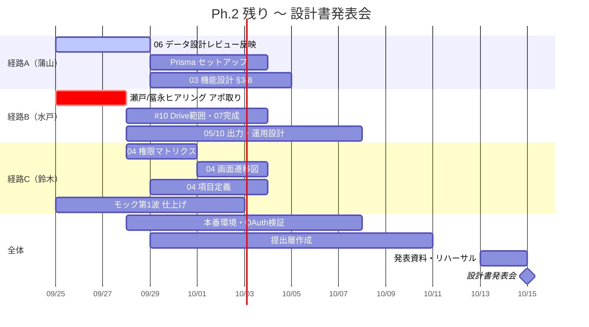

# WBS — Ph.2 残り 〜 設計書発表会（2026-10-15）

> **位置づけ**：いつ・誰が・何を・どの順でやるかに答える、確定した WBS 本体
> **確度**：確定（`pm/wbs-source.md` の一次資料をもとに鈴木が編成）
> **正典**：このファイル
> **更新のしかた**：上書き（実績が動くたびに §5 の状態列を直す）
> **主担当**：鈴木（PM2・スケジュール／タスク管理。企画書 §6-2）
> **最終更新**：2026-09-25（鈴木・4.1.4b 権限マトリクスを完了に更新）

`docs/open-questions.md` P-1（実装優先順を着手順序へ翻訳する作業が未登録だった件）の決着として作成した。**依存の順序は `requirements.md` §1-2 で確定済み**（基盤→背骨→後段）。ここではそれを日程・担当へ翻訳する。

粒度は一律にしない（`pm/wbs-source.md` §3-1 の推奨を採用）。**Ph.2 の残りは作業単位（Lv.3）まで**、**Ph.3 以降は成果物単位（Lv.2）まで**。Ph.3 以降は 06 データ設計が未確定で実装の分量が定まらないため、これ以上割ると精度ではなく虚構が増える。

見積りは人日ではなく「**1〜2週で終わる単位に割れているか**」で置く（`pm/wbs-source.md` §8 D8 の推奨を採用）。学生プロジェクトで人日は精度が出ない。

---

## 1. 全体像（Lv.1）

| ID | フェーズ | 期間 | 状態 |
| --- | --- | --- | --- |
| 0 | Ph.0 企画・確認 | 06-19〜07-17 | **完了**（企画書発表会 07-17） |
| 1 | Ph.1 要件定義・基本設計 | 07-18〜08-20 | **未完了のまま Ph.2 に食い込んでいる** |
| 2 | Ph.2 詳細設計・開発基盤 | 08-21〜10-15 | **進行中**（本 WBS の対象） |
| 3 | Ph.3 機能実装 | 10-16〜11-26 | 未着手。企画書 §6-1 の旧語彙は使わず、`requirements.md` §1-2 の依存順（基盤／背骨／後段）で組み直す |
| 4 | Ph.4 テスト・完成 | 11-27〜12-17 | 未着手 |
| 5 | Ph.5 発表準備 | 12-18〜02-09 | 未着手 |

---

## 2. 前提となる制約

**稼働体制は 9/22 から 3 倍になっている。** これ以前（週1日・金曜6時間のみ）と、これ以降（月4h・火4h・木4h・金6h＝週18h）で意味が変わるため、企画書 §6-1 の「週」をそのまま使わない。ガントは日付そのもので引く（`pm/wbs-source.md` §2-3 に詳細）。

| ブロック | 日程 | 時間 | 備考 |
| --- | --- | --- | --- |
| B1 | 09-22・09-24・09-25 | 14h | **本日 09-25 が最終日** |
| B2 | 09-28・09-29・10-01・10-02 | 18h | |
| B3 | 10-05・10-06・10-08・10-09 | 18h | |
| B4 | 10-13 | 4h | 最終稼働日 |
| — | 10-15 | — | **★ 設計書発表会本番（発表：鈴木）** |

**チーム3名が同時に動ける時間はこの日程がすべて**（`pm/wbs-source.md` §2-3-1 に個別の曜日・稼働内訳あり）。

---

## 3. クリティカルパス — 3本の根

障害ゼロで着手でき、完了すると下流が開く作業は3本。**2026-09-25 時点、A・C は動き出している。B のみ未着手。**

```
【経路A】蒲山 — 06 データ設計（ER図・テーブル定義）
  状態：レビュー中（PR #23・CHANGES_REQUESTED）
    ├→ Prisma セットアップ（2.5.1）
    ├→ 03 機能設計 §3-8（水戸）
    ├→ 04 項目定義（鈴木）
    └→ 09 認可の文脈判定（水戸）→ Ph.3 実装のほぼ全部

【経路B】水戸 — 瀬戸先生／冨永先生ヒアリングのアポ取り
  状態：アポ未取得（唯一のボトルネック）
    ├→ #10 Drive統合の範囲確定 → 07 外部IF設計
    ├→ H-8・概要フォーム現物 → 05 出力設計
    ├→ H-19 → 10 運用設計
    └→ G-1 運用体制 → 10 運用設計

【経路C】鈴木 — 04 画面設計レビュー完了
  状態：完了（2026-09-18・確度「確定」）
    └→ 04 画面遷移図・権限マトリクスが着手可能になった
```

**07 外部IF設計（PR #25）・09 非機能 9-4 追記（PR #27）は、経路Bの決着を待たずに書ける範囲まで先に進んでいる**（蒲山・水戸によるレビュー中の草稿）。経路Bが空いた時点でこれらを完成させる。

---

## 4. タスク台帳（Ph.2 残り・Lv.3）

状態の記法：**済**＝完了／**レビュー中**＝草稿提出済みでPR審査中／**可**＝着手可能（障害なし）／**待**＝依存待ち／**未**＝着手条件が未整理

### 4-1. 基本設計書（`docs/design/` 全10章）

| ID | 章 | 状態 | 担当 | 残作業 | ブロック |
| --- | --- | --- | --- | --- | --- |
| 4.1.1 | 01 システム概要 | **済** | 水戸 | — | — |
| 4.1.2 | 02 業務設計 | **済** | 水戸 | — | — |
| 4.1.3 | 03 機能設計 | 待 | 水戸 | §3-6・§3-8のTODO解消・06完了待ち | B2〜B3 |
| 4.1.4a | 04 画面設計レビュー | **済**（09-18） | 鈴木 | — | — |
| 4.1.4b | 04 権限マトリクス | **済**（09-25） | 鈴木 | — | — |
| 4.1.4c | 04 画面遷移図 | **可** | 鈴木 | 未着手。4.1.4a完了で着手可能になった | B2 |
| 4.1.4d | 04 項目定義 | 待 | 鈴木 | 06完了待ち | B3 |
| 4.1.5 | 05 出力設計（5-4以外） | 待 | 水戸 | 概要フォーム現物・H-7/H-8（経路B）待ち | B2〜B3 |
| 4.1.6 | 06 データ設計 | **レビュー中**（PR #23） | 蒲山 | レビュー指摘の反映・マージ | B1完了目標 |
| 4.1.7 | 07 外部IF設計 | **レビュー中**（PR #25） | 蒲山 | レビュー指摘の反映・マージ。完成には経路B（#10）が要る | B2 |
| 4.1.8 | 08 8-7 デプロイ構成 | 待 | 蒲山 | 本番環境（2.5.3）確定待ち | B3 |
| 4.1.9a | 09 9-1 性能 | 待 | 水戸 | ポーリング間隔・概要集生成目標値（保留中） | B3 |
| 4.1.9b | 09 9-2 可用性・バックアップ | 待 | 水戸＋蒲山 | G-2要件補充待ち | B3 |
| 4.1.9c | 09 9-3 認証方式 | 待 | 水戸 | OAuth検証（2.5.2）待ち | B3 |
| 4.1.9d | 09 9-4 認可（文脈判定追記） | **レビュー中**（PR #27） | 蒲山 | レビュー指摘の反映・マージ | B2 |
| 4.1.9e | 09 9-6 ログ・監査証跡 | 待 | 水戸 | G-5要件補充待ち | B3 |
| 4.1.10a | 10 10-2 初期データ投入方針 | **可** | 水戸 | 未着手。方針は書ける（H-11決着済み） | B2 |
| 4.1.10b | 10 10-5・10-6 運用・引き継ぎ | 待 | 水戸 | G-1要件補充待ち | B3 |
| 4.1.10c | 10 10-7 リハーサル確認運用 | 待 | 水戸 | H-19（経路B）待ち | B3 |

### 4-2. 未決事項の残り（`docs/open-questions.md`）

2026-09-25時点で16件（P-1・#5・T-1・H-24は本日決着し削除済み）。

| 層 | 未決 | 決めるのに要るもの | 担当 |
| --- | --- | --- | --- |
| ER直結 | H-6（提出日時）・H-14（試作品一式）・H-29（所属関係） | 06データ設計の中で潰す | 蒲山＋水戸 |
| 外部連携 | #10（Drive統合の範囲） | 経路B（瀬戸先生） | 水戸 |
| ロール | #8（先生ロール二層） | チーム合意（先行方針＝単層） | 水戸 |
| 画面 | T-2（コメント編集・削除） | モックで決着（現在検討中） | 鈴木＋水戸 |
| 画面 | H-4（検索の単位） | 用途確認 | 水戸 |
| 出力 | H-7・H-8（概要集の陳腐化） | 経路B（冨永先生） | 水戸 |
| 業務 | H-19（リハーサル確認運用） | 経路B（冨永先生） | 水戸 |
| その他 | #7（テンプレート）・T-3（使用技術欄） | — | 水戸 |
| 要件欠落 | G-1・G-2・G-5（運用・可用性・ログ） | ヒヤリング＋技術方式 | 水戸＋蒲山 |

### 4-3. ステークホルダー対応（リードタイムを持つ唯一の作業）

| 相手 | 回収するもの | 状態 |
| --- | --- | --- |
| **瀬戸先生**（Drive/Workspace管理権限者） | #10の承認・G-1のシステム管理と費用 | **アポ未取得。最優先で着手** |
| **冨永先生**（運営実務担当） | 概要フォーム現物・H-8・発表1コマの所要時間・H-19・G-5・チーム数 | **アポ未取得。最優先で着手** |

### 4-4. 開発基盤

| ID | 作業 | 状態 | 担当 |
| --- | --- | --- | --- |
| 4.4.1 | Docker（PostgreSQLのみ） | **済** | 蒲山 |
| 4.4.2 | Prismaセットアップ・マイグレーション | 待（06完了待ち） | 蒲山 |
| 4.4.3 | Auth.js × 学校GoogleアカウントOAuth検証 | 未（意図的に後回し・正典と整合） | 未割当 |
| 4.4.4 | 本番環境（ホスティング）確定 | 未 | 水戸 |
| 4.4.5 | PDF生成手段の技術検証 | **済** | 蒲山 |

### 4-5. モック画面（20画面）

**`04-screen.md` §6 の3波。D10決定（`pm/wbs-source.md` §8）により、第2波・第3波は10/15のスコープから外し、Ph.3へ送る。**

| ID | 対象 | 状態 |
| --- | --- | --- |
| 4.5.0 | `feature/mock`を`main`へマージ | 未（`package.json`衝突が既知） |
| 4.5.1 | 第1波：SC-01,02,03,04,06,09,12,13,14（9画面） | 進行中（視覚改善中） |
| 4.5.2 | 第2波・第3波（残り11画面） | **10/15スコープ外（Ph.3送り）** |

### 4-6. 提出層・発表準備

| ID | 作業 | 期限 | 担当 |
| --- | --- | --- | --- |
| 4.6.1 | 提出層の作成（学校提出用設計書） | 学校フォーマット開示後、または10/1のいずれか早い方 | 水戸 |
| 4.6.2 | 発表資料の作成 | B4まで | 鈴木＋水戸 |
| 4.6.3 | リハーサル | B4 | 全員 |
| 4.6.4 | 発表本番 | 10-15 | **鈴木** |

---

## 5. スケジュール（ガント）



---

## 6. WBS編成にあたって決めたこと

`pm/wbs-source.md` §8 で鈴木の判断とされていた項目のうち、本WBSで採用したもの。

| # | 論点 | 採用 |
| --- | --- | --- |
| D1 | WBSの粒度 | **(b) Ph.2残りは作業単位・Ph.3以降は成果物単位**（ローリングウェーブ） |
| D8 | 見積りの置き方 | **(c) 「週内に収まるか」の粒度**。人日は置かない |
| D4 | 役割分担の見せ方 | 稼働の制約として見せる（水戸が既に採用済み・§2参照） |
| D10 | モック第2波・3波の扱い | 10/15スコープから外しPh.3へ送る（水戸が既に採用済み・§4-5参照） |

**D9（実践ゼミの持ち時間・提出形式）は未回答のまま。** 日程（9/18本番）は確定済みだが、詳細が分かり次第この節を更新する。

---

## 7. リスク

- **経路B（ヒヤリングのアポ取り）が唯一未着手。** #10・05・10の3系統がここに乗っており、遅延の影響が最も広い
- **06データ設計のレビューが長引くと、Prisma・03・04項目定義・09認可判定の4系統が同時に止まる**（クリティカルパス）
- **`feature/mock`の`main`統合（`package.json`衝突）は着手日が未定。** 10/15の提出物は設計書であって動くアプリではないため優先度は低いが、Ph.3開始前には解消が必要
